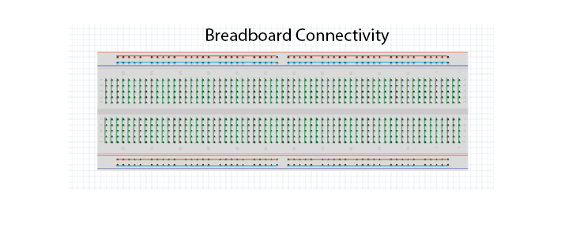
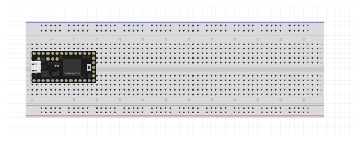
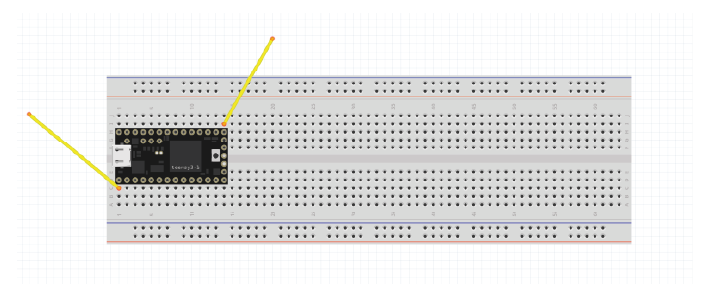
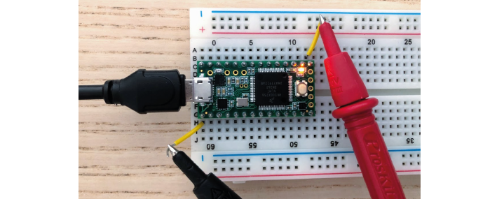
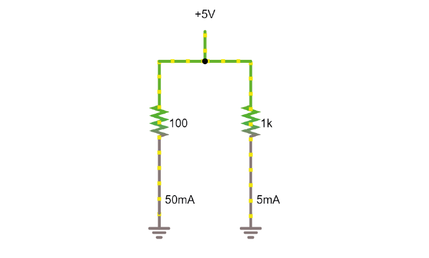
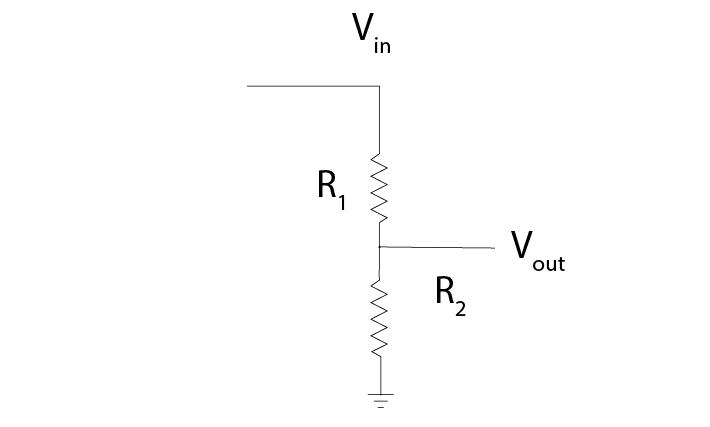
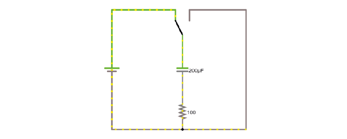

.. _refEDay1TA:

***********************************
Exercises Day 1 TA
***********************************

.. |Na+| replace:: Na\ :sup:`+`\
.. |Cl-| replace:: Cl\ :sup:`-`\
.. |Ca2+| replace:: Ca\ :sup:`2+`\
.. |K+| replace:: K\ :sup:`+`\
.. |Rs| replace:: R\ :sub:`s`\
.. |Rm| replace:: R\ :sub:`m`\
.. |Re| replace:: R\ :sub:`e`\
.. |Rsh| replace:: R\ :sub:`sh`\
.. |Ce| replace:: C\ :sub:`e`\
.. |Csh| replace:: C\ :sub:`sh`\
.. |Vin| replace:: V\ :sub:`in`\
.. |Vec| replace:: V\ :sub:`ec`\
.. |Vout| replace:: V\ :sub:`out`\
.. |Ve| replace:: V\ :sub:`e`\
.. |Za| replace:: Z\ :sub:`a`\
.. |Ze| replace:: Z\ :sub:`e`\

.. contents:: Table of Contents
  :depth: 2
  :local:

.. admonition:: TA Note
   :class: tanote

   For many students, day 1 is about getting to know the equipment & using the right names for everything. Unless students are already confident, it's best to take everyone through day 1 as a group:

   - Show them the probes for the oscilloscope

   - Check they understand the multimeter and oscilloscope and what they're measuring

   - Make sure they can scale their picoscope software

   Check that everyone has a nice signal each time before moving on and that basics are clear, like which parts of the breadboard are connected.

1.	Using a multimeter
###################################

.. container:: exercise

    1A.	Make sure the multimeter has batteries installed. Put the red lead in the port marked ‘VmAuA’ and the black one in the port marked COM.

    1B.	Set the multimeter to ‘Ω’. Use your multimeter to measure the resistance of any 3 different resistors in the kit. Check whether the resistance values you read correspond to the bands on the resistors. How is your multimeter measuring this resistance?

    1C.	Now set your multimeter to measure the voltage across a battery. What does it mean if you record a negative voltage?

.. admonition:: TA Note
  :class: tanote

  1C: 1.62 V. If you record a negative voltage you just have to switch the lead around, it’s convention: the positive side of the battery should be the red.

  To measure resistance, the multimeter generates a voltage at both probes, and measures the current generated between them.

Solderless Breadboard
***********************************
To build circuits during the course, we are going to use a solderless breadboard.
If you need to, refer back to the `reading material <https://learn.sparkfun.com/tutorials/how-to-use-a-breadboard/all#anatomy-of-a-breadboard>`_ for the overview on how to use a breadboard, it also includes some basic troubleshooting which may prove useful if you run into problems.

The most important thing is to remember which holes are connected. Your long breadboard is actually made up of two separate breadboards; + and – rails run through rows 0-30 and 31-60. If you want to use the entire length of the breadboard, you will have to connect these rails together with wires.

Teensy Microcontroller
**********************************
In your kit you will find a Teensy 3.2. This is a microcontroller (a small computer) that can generate output voltages or collect input voltage signals.

We can control the Teensy through software. In terms of hardware, we interact with the Teensy through its 'pins' or 'vias'. Different vias have different functions.

The kit includes a Teensy pinout card. This diagram (‘pinout’) shows us what each pin of the Teensy can do. Each gold circle (‘via’) on this pinout represents an input or output of the Teensy.

Your teensy already has header pins attached, so that you can click it into your breadboard.

It’s important to distinguish between:

* Ground pins (GND)
* Analog pins, that can read varying voltages, such as a wave. There is also an analog ground.
*	Digital pins, that can read or write HIGH or LOW values.

We’re going to attach the Teensy to our solderless breadboard. Removing and replacing the teensy can sometimes bend the pins, so we’re going to leave it here for the whole course.

.. warning::
  If you have to remove the teensy from the board, never hold it by the USB port, as it can easily snap off!

.. container:: exercise

  1D.	Attach the teensy to the left of your breadboard as shown above. If you make sure the breadboard is in the same orientation as this schematic, it will make the following exercises easier to follow.

  1E.	Use the USB to micro-USB cable in your kit to connect the Teensy to your computer. The Teensy comes with a default programme already loaded onto the board, so you should see the LED on the board start to blink slowly as soon as it is powered on.

  1F.	We can see that digital pin 13 has (LED) written beside it. Attach readout wires to the breadboard, and use your multimeter to find the voltage across the LED.

.. admonition:: TA Note
   :class: tanote

   1E: If they need to upload the programme again, they can open the Arduino software: examples/basics/blink. Any problems, check:

   - Whether the board is set to Teensy under Tools/Board

   - The selected port Tools/Port

   1F:   Should be around 3.3V when it is on.

2.	Using an oscilloscope
###################################

Oscilloscopes let us measure time-varying voltages with much higher time resolution than the multimeter.

.. container:: exercise

    2A. Your Picoscope comes with two probes, you only need one. Connect it to the ‘A’ port on your oscilloscope.

    2B. Set the slider on the probe itself to ‘1x’. Connect your PicoScope to your computer and open up the Picoscope software.

    2C. Use the PicoScope to measure the blink signal at the readout wires, as you did with your multimeter. Make sure you play around to find nice X and Y scaling. What shape & amplitude does the signal have?

    .. image:: ../_static/images/EEA/eea_fig-14.png
      :align: center

If you see something odd, check:

*	x-axis scaling (ms/div)
*	y-axis scaling (Auto doesn’t always work)
*	whether it is set to DC (direct current) or AC (alternating current).

.. admonition:: TA Note
   :class: tanote

   2C: Should see a clear square wave of around 3.3 amplitude.

   .. image:: ../_static/images/EEA/eea_fig-66.png
     :align: center

   NB: sometimes connecting the ground directly to the Teensy causes it to charge (you can see it with the scope) and it can end up disconnecting from the PC and making a mess. They don’t actually need the ground of the scope connected to see the large sine wave because of the scope’s high input impedance. That might be confusing now, but should be clearer after talking about impedance tomorrow.

   !!! If a student's scope isn't responding to any input, before panicking check that they are not using the 'automotive' version of the Picoscope software as this will make the scope look dead.

We’ll now use the Teensy microcontroller to output a sine wave, instead of the blink example.

.. container:: exercise

  2D. Open the Arduino Software Upload the following code to your teensy:

  :ref:`sinewave`

  Make sure that under ‘Tools/ Board’ your Teensy 3.2 has been found, and check which USB (COM) port it’s in (‘Tools/Port:).
  If you see ‘Done Uploading’, the Teensy will start giving a sine wave as output from one of the analog output pins.

  2E.	Measure the output with your multimeter, from pin A14.

  2F.	Connect your oscilloscope probe to A14 and visualise the signal in your PicoScope software.

  .. image:: ../_static/images/EEA/eea_fig-15.png
    :align: center

.. admonition:: TA Note
   :class: tanote

    2D: If they get an error ‘redefinition of void setup’ it’s because they dragged the sketch to the software,  then it gets added to the other sketch, needs to be uploaded separately.

    2E: They should see a constant voltage of around 3.3 volts from A14 to GND, because their multimeter doesn’t resolve the signal fast enough to see the waveform. Pin A14 is a DAC, digital to analog converter, so it can take the digital representation and output an analog(ish) sinewave. Make sure they don't get mixed up with digital pin 14 (analog pin 0).

    These exercises are just to check that they understand the value of having the oscilloscope over the multimeter- that knowing the shape of the signal is important. It helps to keep linking this back to their neural signals- what if you were undersampling them, you wouldn't see spikes. Make sure they are ok with the idea of alternating signals, and that digital and analog signals are clear as well.

3. Ohm’s Law
###################################
During this course, we’ll be using a circuit simulator to build our circuits online. This allows us to quickly test our ideas and understanding, and make predictions about what will happen when we build the circuit in real life.
Ohm’s law describes how potential (V), current (I) and resistance (R) are related:

.. math::

  V = IR

When looking at a whole circuit, we can use this to calculate how much current will flow. Here is a simple circuit with a battery and two resistors. Current flows from the positive terminal of the battery to ground, which is the negative terminal of the battery.

.. image:: ../_static/images/EEA/eea_fig-16.png
  :align: center
  :target: https://tinyurl.com/y4r8nsnj

.. container:: exercise

3A. Click on the image to go to the simulator.
Right-click on the top wire in the circuit, and then select Edit to display the current through that wire. Double-click on either of the resistors to decrease their value and see how the current in the circuit responds.

4.	Resistors
###################################
Here’s another simulation demonstrating Ohm’s law. This time, the current moves from a 5 Volt voltage source (bright green) into ground (grey, earth), across one of two resistors.

.. container:: exercise

  4A.	Display the voltage and current over both resistors in the ‘scope’ (right click/show in new scope). What will happen to the voltage over the left resistor if you double its resistance? What will happen to the current?

  4B.	What will happen to the voltage and current over the right-hand resistor? Double the value in the simulator and see if your predictions were correct.

.. admonition:: TA Note
   :class: tanote

    Students can get confused about using Ohm's law over a whole closed circuit (to get current) and over individual components (voltage drops). It helps to remind them at which points in the circuit current must be equal and where voltage must be highest and lowest. Check that they understand why the current across these two resistors can be different, but not in the closed circuit above.
    Decreasing the resistance of any of the two resistors increases the current since they are in series and V = I * (R1+R2). Changes the ratio of the resistors changes the voltage drop over each resistor.

    4A: voltage over both resistors is the same as they are connected in parallel to a 5V source. Current will vary with resistance.

    Circuit analysis refresher
    In series: same current flowing through components. In parallel: same voltage across components. KCL in each node current should add up to zero. KVL in each loop voltage should add up to zero.

    Methods for solving a circuit: Equivalent https://www.khanacademy.org/science/in-in-class10th-physics/in-in-electricity/in-in-solving-a-circuit-with-series-and-parallel-resistors/v/solved-example-finding-current-voltage-in-a-circuit and more advanced methods https://www.khanacademy.org/science/electrical-engineering/ee-circuit-analysis-topic/ee-dc-circuit-analysis/a/ee-circuit-analysis-overview

5.	Voltage Divider
###################################
In simulator
***********************************
When we measure how much voltage is provided by a voltage source (such as a battery, or the output from the Teensy), we always measure it relative to a point that we consider 0V. In a circuit powered by a battery, we consider the negative terminal to be at 0V. If there is a connection to earth, or ground, this is taken as 0V.

Voltage (potential energy) ‘drops’ over each resistor, as potential energy is converted to another form of energy (such as heat or light). In a circuit powered by a 9V battery, all 9V of potential energy from our battery source *must* drop over circuit components, so that we end up back at 0V.

In each circuit below, the current through R1 and R2 must be same. Given the same current, the higher the value of the resistor, the higher the voltage drop over it (V=IR). The total voltage drop over the circuit must equal the provided voltage.

That means that, in a circuit with multiple resistors in series, the ratio of their resistances determines how much voltage will drop over each. We can therefore split up (divide) the voltage from a source across resistors. If we measure the voltage in between these resistors as |Vout|:

.. math::

  |Vout| = |Vin| \frac{R2}{R1+R2}

.. container:: exercise

5A.	Using the simulator (here’s an empty full-screen https://tinyurl.com/y477e9qd) build a voltage divider circuit in which you use a 3V battery and two resistors to provide an 272 mV output voltage |Vout|.

.. admonition:: TA Note
   :class: tanote

   Voltage divider circuits:
   https://tinyurl.com/y2n2wg5a

   Sparkfun overview:
   https://learn.sparkfun.com/tutorials/voltage-dividers/all#extra-credit-proof

On breadboard
***********************************
We’ll now build the circuit you just designed in real life, using a solderless breadboard.

.. container:: exercise

  5B.	Use the battery holder and two AA batteries to create a 3V source. Use any two resistors from your kit to build a voltage divider, as shown below. If your multimeter doesn’t fit in the breadboard holes, you can place a short piece of wire at each point you want to measure.

  .. image:: ../_static/images/EEA/eea_fig-19.png
    :align: center

  .. image:: ../_static/images/EEA/eea_fig-20.png
    :align: center

  Bonus exercise: Replace one of the resistors to make your output voltage as small as you can get it. What’s the smallest reading you can still pick up with your multimeter? How does this compare to the amplitude of a spike measured in the extracellular space?

6. Capacitors
###################################

.. warning:: Always check whether your capacitors are polarised or non-polarised. Polarised capacitors must be used in a specific orientation. Usually, ceramic (the yellow ones in your kit) capacitors are not polarised and you can use them in either direction, whereas tube-shaped electrolytic capacitors (the black and blue ones in your kit) **are** polarised. The negative pin is indicated by a ‘-’ marking, and the positive leg is often longer.

Capacitors, direct current
***********************************
.. admonition:: TA Note
  :class: tanote

  Skip this exercise if running out of time

Capacitors are made of two conducting plates, separated by an insulating material that prevents the plates from touching. Charges cannot jump through the insulating layer. Instead, charges collect on one plate, forming an electric field that pushes away similar charges on the opposite plate. This movement of charge is what gives us current flow in the circuit, even though charges cannot flow directly through the capacitor.

.. math::

  Q = C * V

The amount of charge (Q) a capacitor can separate depends on is its capacitance (C, measured in farads) and the voltage (V) across the capacitor.

In a direct current circuit, current will flow while the capacitor charges, as charge is pushed or pulled on either plate. Current flow will stop once the capacitor is fully charged. This electric charge can be discharged (and, for instance, used to power something) by providing a path that connects the positive and negative charges of the capacitor.
In this simulation, you can charge and discharge a capacitor and see the current flow through the circuit.

.. container:: exercise

  6A.	Modify the simulation to power an LED (Draw/Outputs and Labels/Add LED) by the capacitor as it discharges. The simulator will turn the LED red when it is on.

  6B.	Using the breadboard, build this circuit to charge and discharge one of the large capacitors in your kit.

  .. image:: ../_static/images/EEA/eea_fig-23.png
    :align: center

  .. image:: ../_static/images/EEA/eea_fig-22.png
    :align: center

  6C.	In this configuration, you will need to move the + leg of the cap (where the oscilloscope probe is) between GND and +3V. In the schematic, the + leg is connected to +3V, in the photo it is connected to GND.
  You should see it charge and discharge in your PicoScope trace. How long does it take for the capacitor to charge?

  6D.	Change the value of the resistor. What does this change in your trace? Can you explain why?

.. admonition:: TA Note
   :class: tanote

    6A: https://tinyurl.com/y5p5y5p2

    6D: Results should look like figure below. Top panel: 220 kOhm, lower panel:very low resistance. Why? Because the resistor is setting the current through the circuit, determining how fast the capacitor is allowed to charge.

    .. image:: ../_static/images/EEA/eea_fig-67.png
      :align: center

7. Alternating signal (AC)
###################################
So far, we have mostly used resistances and Ohm's law to describe how the circuit resists direct current flow. This is applicable to direct current situations (such as batteries), but the action potentials and LFPs we measure from neurons can go in both directions- they are alternating currents. So, how do resistances and capacitors ‘resist’ alternate current flow?
Alternating currents have different frequencies. Action potentials cause very fast changes in current (and potential), whereas synaptic inputs and their sums are much slower. We have to make sure the frequencies we are interested in can travel through our recording circuit.
Here is a demo where an alternating signal increases and decreases in frequency. At the bottom of the page, you can see the wave visualised.

.. note::

  When you have capacitors in the simulator, it is a good idea to click 'reset' whenever you make changes, as they will otherwise store charge and can create weird effects.

.. container:: exercise

  7A.	Press ‘Play Audio’ to hear how the sound is modulated as the frequency increases.

  .. image:: ../_static/images/EEA/eea_fig-24.png
    :align: center
    :target: https://tinyurl.com/yyrvugha

When we were only dealing with resistors, changes in our circuit happened instantly. We have seen that introducing a capacitor into our circuit means that we have to take time into account, as it takes time for the capacitor to charge and discharge. Resistors are not sensitive to changes in frequency, but capacitors are.

8. Impedance
###################################
To describe restriction of direct current flow, we used resistance (R). To describe opposition to alternating current, we need to use the term Impedance (Z), which takes into account time-varying signals. See the theory handout for more information.

.. container:: exercise

    .. image:: ../_static/images/EEA/eea_fig-25.png
      :align: center
      :target: https://tinyurl.com/y3sbgfl6

    Here are two circuits, both provided by an alternating voltage source with a different frequency. In the scope below, the voltage trace of the source and the capacitor are plotted.

    8A.	Visualise the current in the circuit (for instance the current flowing through the stretch of wire). You could add a new scope to do this or double-click the wire and 'show current'. Which circuit has higher current?

    8B.	Add a third circuit, powered by an alternating voltage source of 120 Hz. What happens to the current as the frequency increases?

    (Bonus question: what happens to the voltage drop across the capacitor as frequency increases?)

.. admonition:: TA Note
   :class: tanote

   With increasing frequency, the impedance of the capacitor decreases. That means that:
   - The overall current in the circuit increases (I = V/R with lower R)
   - The ratio of impedance between the 200 Ohm resistor and the capacitor changes. It's another voltage divider: the 5 volt must still be 'spent' in the circuit, but more of it now goes to the 200 Ohm resistor. The voltage drop over the capacitor reduces as its impedance reduces.

The impedance magnitude of a capacitor, also called reactance (X\ :sub:`c`), depends on:

.. math::

   Xc = \frac{1}{2 \pi fC}

Where f is the frequency with which the current alternates, and C is the capacitance. With increased frequency or capacitance, a capacitor will provide less restriction of current flow.

When you see a capacitor in a circuit, you know you need to think about the frequency of the signal. Steady direct current has no frequency, so X\ :sub:`c` is infinite: capacitors only pass alternating signals.

9. Capacitive voltage divider
###################################
Because capacitors impede current flow, we can use them to build voltage dividers, just like the resistor divider shown above.

.. container:: exercise

  .. image:: ../_static/images/EEA/eea_fig-26.png
    :align: center
    :target: https://tinyurl.com/y5kq7yct

  9A.	Try changing the capacitance values C for the first capacitor. How does this change your output voltage?

Wrap Up
#########################################################

.. admonition:: TA Note
  :class: tanote

  If they don't make it through all the exercises that's ok, but concepts that they should understand are:

  - What is an oscilloscope measuring?

  - How does a voltage divider work?  (this keeps coming back during the course)

  - What is the important difference between capacitors and resistors? (Frequency-dependent impedance changes of capacitors, also keeps coming back)
