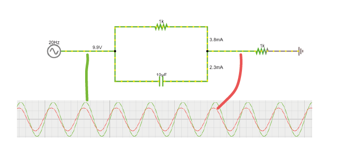
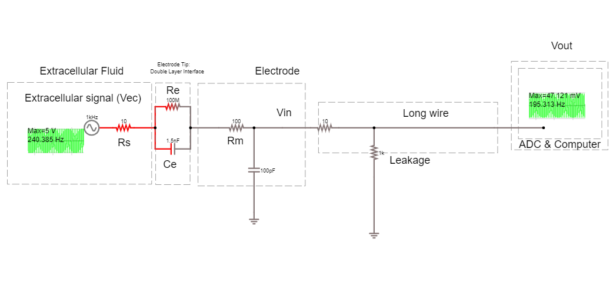
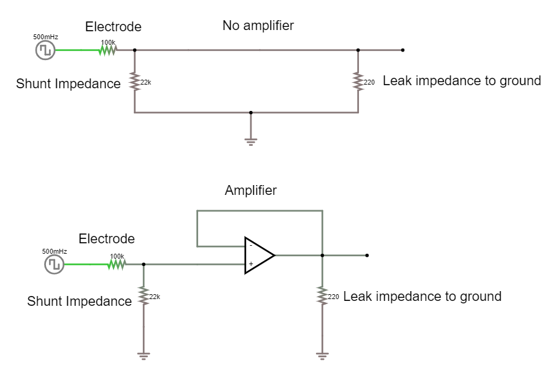
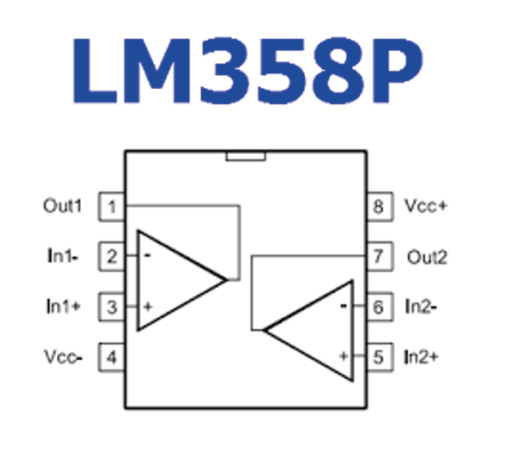

.. _refEDay2TA:

***********************************
Exercises Day 2 TA
***********************************

.. |Ve| replace:: V\ :sub:`e`\
.. |Ce| replace:: C\ :sub:`e`\
.. |Rm| replace:: R\ :sub:`m`\
.. |Re| replace:: R\ :sub:`e`\
.. |Cs| replace:: C\ :sub:`s`\
.. |Vin| replace:: V\ :sub:`in`\
.. |Vec| replace:: V\ :sub:`ec`\
.. |Vout| replace:: V\ :sub:`out`\

.. contents::
  :depth: 2
  :local:

1. Capacitor and Resistor in parallel
#########################################

In the circuit below, you will see a capacitor and a resistor in parallel. The voltage source alternates at 20Hz, going from -10 to +10 volts. The current travels over the resistor or via the capacitor to ground.

.. container:: exercise

  1A.  Increase the value of the resistor to 200kOhm. What happens to the current?

  1B.  Put the resistor back to 1kOhm. Now, increase the capacitance of the capacitor to around 10mF. What happens to the current?

  1C.  Return the values to 1kOhm and 10uF.

  Change the frequency of the alternating signal to:
  - 1000 Hz (action potentials!)
  - 1 Hz
  You may have to change the simulation speed using the red slider at the top right, and adjust the x-scaling of the scope below (right-click / properties / and slide the 'horizontal scale').

  1D. How does the frequency of the signal relate to how much current crosses either the capacitor or the resistor?

2. The equivalent circuit of the electrode
##############################################

In the theory handout, we discussed how we can represent an electrode as a circuit containing a resistance and a capacitance. We’ll now build this equivalent circuit in the simulator.

.. container:: exercise

    2A.	Edit the circuit used above to build the equivalent circuit of a polarised, tungsten electrode.

    Here are some values to use:

    *	|Rm|: the DC resistance of the metal electrode wire, 10-100 Ohms.
    *	|Ce|: the electrode tip capacitance, generated by the double layer generated around the electrode.  |Ce| ~ 0.2 pF / µm2, so 10 - 20 pF (if the electrode is unplated)
    *	|Re|: electrode tip resistance, in parallel with |Ce|. ~ 100 MOhm.

    2B.	Edit the alternating voltage supply to provide 1V at 1Khz, mimicking the signal coming from your cell. 1V is larger than ephys signals, but makes the current flow easier to see. Change the sliders for simulation speed and current speed until you can see where the current is flowing.

    2C. What happens if you delete the resistor |Re|?

    2D. Bonus exercise: Can you change this circuit from a polarising, tungsten electrode, to a circuit representing a nonpolarizable electrode?

    .. admonition:: TA Note
       :class: tanote

       2C: Should see little difference if electrode is only represented by capacitor

       .. image:: ../_static/images/EEA/eea_fig-80.png
         :align: center
         :target: https://tinyurl.com/yzzjjvdk

       Circuit of electrode: https://tinyurl.com/yzzjjvdk

       2D: Reduce Re until current flows through Re.

3. Impedance
##########################

Here is the circuit, with a shunt impedance added of 100 pF:

.. image:: ../_static/images/EEA/day2circuit.png
  :align: center
  :target: https://tinyurl.com/y2jshzqc

.. container:: exercise

  3A. What is shunt impedance?

  3B. What % of our signal are we losing between Vec and Vin? Why?

  3C. What could we change to increase the signal at Vin?

  3D. The tips of certain electrodes, e.g. nichrome tetrodes, can be electroplated in a thin layer of gold. This 'goldplating' increases the surface area of the tip, creating more space to separate charge. This increases tip capacitance by around 100x. Make this change in the circuit. How similar are Vec and Vin now?

.. admonition:: TA Note
   :class: tanote

   3A: Shunt capacitance Csh and shunt resistance Rsh are both routes to ground outside of the intended acquisition system. At the high frequencies (1kHz) we are interested in, the capacitive component will have low impedance, and will therefore have more effect than the resistive component, so Rsh is often ignored.
   Remember that any two conducting surfaces, with a non-conducting layer in between, is a capacitor. Shunt capacitance arises mainly from the capacitance across the thin insulation layer isolating an electrode and the surrounding electrolyte, as well as the cumulative capacitance along cables and connectors (Robinson, 1968).

   3B: Should be 655 mV left of our 5V signal. Vec = 5V
   Vin = 655mV
   Losing 87%
   The capacitor of our electrode and the shunt capacitance are forming a voltage divider.

   3C:
   Changing the impedance ratio changes the Vin. Vin = Vec * Zsh/(Ze+Zsh). We want Vec to be multiplied by a ratio that is close to 1, so Ze should be as small as possible: we need to increase Ce. There’s not much we can do to reduce Zsh.

   3D: Gold plated electrode circuit: increases capacitance, decreases impedance.  https://www.falstad.com/circuit/circuitjs.html?ctz=CQAgjCAMB0l3BWEAmA7NVbnIBwBYFkBmMIogThxFSqTyJAQFMBaMMAKAHcQ2A2SFF7tkQyN2FhRgtlJB4q4gMaTRC3kTWLw0Zi3K8YkVKjyoE5cqlLJ2lvFFiROPFpvlU30qBK9D3guIASrzIkNosyAh8YuDg8IyxMAi+IkKyoizq4gBOqrzqflnaYPBl4q7uxRre4gAevDiovCa8CM0spvIoDkFMHA36DuQQLHzDDg7IDgDC-YN44W0GbHgOLNHd0yAAonUALjkAhkpMADZnAK5nRzkAOgDODwCWAOYAdkdnjwAUAGpMJQASg4eUiSxkYAEsVKoJAAXAckC8Xqwis8lGUKoay2vQeA0YECIVBw2IgU16AFsOK9EaIwOR6XIwtplHShGkGd4wKxSsJoFDohYBIsiJByHwAk54C52YIwKgYoECVCGJEYgyOsRcSA-s93gS2MZhIsNOtSM0HHIdmdAYcAPYAEyYjwAKs8AA4ALg4ACMCmZhJA1VJ5bgfP7ZJjIJkyOBkAZxJGwkGiQgIDYfIMiF02LZhPhJNiersDsdThdrrdHgAxK7PR0qsDm-PYTLsYvbG12nJOl34wZSEPbSLCfNW0QAEXtl19tseABkjgBPJj3B4ASXe+zXADMTv17YlxhzsJREkY4BBBKIkEQOEewFQT2GE9joHxSSImuQ8MRzEq0oZig4BUPeQA
   Students can get impedance and capacitance mixed up and forget they go in opposite directions.

Drawing Current
***********************************
Let's do a recording! We'll take our electrode, and attach it through a long wire to a recording system (the recording system has an analog to digital converter, ADC, and a recording computer). The leakage resistance here is because the recording system is also connected to ground.

.. container:: exercise

  3E. How much of the voltage at the electrode, Vec, are we recording at Vout?

  3F. Place an ideal operational amplifier between the electrode and the long wire. What happens to Vout? Why?

  3G. Change the circuit to stop the amplifier from saturating. What is the amplifier gain now?

.. admonition:: TA Note
   :class: tanote

    3E:
    Vec = 1V
    Vout = 5.027 mV
    0.5%
    We are drawing current from our source.

    3F: Menu: Active construction blocks - OpAmp. Vout hits +- 15V, it is saturating to the value of the power rails, because it has very high gain. It is calculating the difference between + and - multiplying it by its huge gain.

    3G: https://tinyurl.com/y454jqlb We need to do something to prevent our amplifier from always hitting power-rail values. We can provide negative feedback to the amplifier by looping the output back and feeding it into one of the terminals. Connect the amplifier output to the inverting input. The amplifier is going to do the same thing as before; output the difference between + and - multiplied by its huge gain. The output will rise rapidly, however this time, as soon as it reaches the value of the + terminal, the + and – are the same value and there’s no difference left to amplify. Now we’re just seeing our input signal replicated at the output of the amplifier with a gain of 1.

4. Operational Amplifiers
###################################
Let’s build a slightly simplified version of these circuits in real life, on the breadboard. We’ll treat the ‘Blink’ example as our neuronal data and see what happens to this signal if we just have a wire, and then see the effect of replacing this wire with an op-amp. We'll simplify our electrode circuit to a single resistor.

* 'Neuron'  = Digital blink output from Teensy
* 'Electrode' = 100 kOhm resistor
* 'Shunt' = 22kOhm resistor
* 'Leak' = 220Ohm resistor
* 'Recording system' = the Picoscope

Without an amplifier
************************************

.. container:: exercise

  4A.	Upload the Blink example to your teensy (or just run it if still loaded).

  Build the circuit below:

  * Send the Teensy output through a 100 KOhm resistor. This makes it behave a bit like a biological signal coming from an electrode.

  *	A 22kOhm resistor to ground simulates shunt impedance.

  * A 220 Ohm resistor to ground simulates that your acquisition system is connected to ground (via some resistance).

  *	The yellow wires are 'readout' wires to connect your oscilloscope to.

  .. image:: ../_static/images/EEA/eea_fig-39.png
    :align: center

  .. image:: ../_static/images/EEA/eea_fig-38.png
    :align: center

  4B.	Now measure the output with the oscilloscope at the points marked by red arrows in the image below, and complete the first column of the table below:

  .. list-table::
     :width: 80%
     :widths: 20 20 20
     :header-rows: 1
     :align: left

     * - (+) Probe Location
       - Long Wire
       - Op-Amp
     * - 1. Teensy Pin 13
       -
       -
     * - 2. Readout Wire 1
       -
       -
     * - 3. Readout Wire 2
       -
       -

  4C. How much signal is lost?

  .. admonition:: TA Note
     :class: tanote

     See full table below.
     It might be tricky to understand that one has the same value in rows 2 and 3 of the op-amp headstage configuration, since we are adding an amplifier and one would expect the signal to have been amplified. But our amplifier has unity gain here, so that is why there is no amplification, and it highlights its important function of protecting our signal by not drawing current from the source thanks to its huge input impedance.

Build voltage rails
***********************************
.. warning::
  Make sure that the pins from the batteries do not touch, and if they’re not in use, best to put some tape on them so they don’t touch things. ‘Short-circuiting’ the batteries (connecting them without any sort of resistance) causes a huge current to flow from the + to -, enough to... melt stuff.

Now, we need to make the ‘rails’ that will provide the voltage for our op-amp. Eventually, for our EMG circuit, we will need to have a positive and negative voltage ready, so that we can amplify a signal that lives around some reference level that we shall call 0 volt. If we only have 0 and +3V, then any negative signal will floor and stay at 0.

To do this we use a common trick and turn two regular power supplies into a bipolar power supply. In our case we use batteries, because they’re cheap and pretty much fully noise-free. Check which way up your breadboard is (keep the blue line at the top). Following the figures precisely will make debugging much easier later on.

.. container:: exercise

  4D. Connect the battery holders as follows:

  - One pair of batteries provides 3V relative to ground, 0V.

  - Both ground rails are connected through a wire.

  - The second pair of batteries is reversed to provide -3V relative to ground, so that we get a + and a – voltage.

  - Remember or label which side is +3 and which is -3

  .. image:: ../_static/images/EEA/eea_fig-35.png
    :align: center

Add bypass capacitors
***********************************
Bypass capacitors are small capacitors that act like little secondary batteries. In our case we’ll add two 100nF (marked 104) caps, one to each rail, so GND to 3V and GND to -3V. The reason is that the batteries we use have what's called a high ESR - ‘equivalent series resistance’ and some capacitance, so they are not great at quickly providing current. This means that when our op-amp starts working, it can run out of current for a very short time, until the battery can drive the rails back to their original voltage. This is bad for the signal quality.
So, we give the rails the ability to very quickly provide a small amount of current from these small capacitors. We’re exploiting the fact that these caps have very low ESR and can provide current pretty much instantaneously. If the battery briefly can’t provide current, the bypass capacitors will discharge, providing quick back-up current. The fact that they’re too small to power anything for more than a millisecond does not matter here, at that point the batteries have caught up.

.. container:: exercise

  4E. Add two 100nF (marked 104) caps, one to each rail, so connecting GND to 3V and connecting GND to -3V (see image below).

  .. image:: ../_static/images/EEA/eea_fig-36.png
    :align: center

Replace the 'long wire' with 'headstage'
***********************************************
We will replace our long wire with a 'headstage'. We will use only the most basic part of the headstage, an operational amplifier.

This is the op-amp you have.  Make sure you’re looking at the op-amp (AS358P), not the instrumentation amp.

.. container:: exercise

  4F. Add the op-amp to the circuit.

  * Place the op-amp on your breadboard, with the semicircle cutout on the left.

  * Connect the +3 voltage rail to ‘Vcc+’ and the -3 voltage rail to ‘Vcc-‘

  * Put the electrode output wire into the + input of your op-amp, and the output of the op-amp into the ‘wire’ simulation circuit.

  * Feed the output of the op-amp, back into the – input.

  .. image:: ../_static/images/EEA/eea_fig-42.png
    :align: center

  .. image:: ../_static/images/EEA/eea_fig-40.png
    :align: center

  4G. Now measure the same three points as before and complete the table in question 4B.         -

  4H. Optional: try changing the resistances you've used for electrode, shunt, and leakage. What happens to the signal?

.. admonition:: TA Note
  :class: tanote

  The wire now cannot destroy our signal, because even though we did not amplify it at all (we only have unity gain) we ‘buffered’ it. Now the op-amp can push as much current into the wire as is needed and your signal makes it through.

  Optional exercise: Make a version of this circuit that's more similar to ephys signals by using a sinewave.

  - Send sinewave (code in day 1) to pin A14 (no header soldered there but can use a wire, connection is a bit unstable)

  - make it faster (at least 20 Hz, it's still slower than ephys but they get the idea)

  - Use capacitors instead of Resistors, e.g. 104 for electrode, 22 for shunt

  - Connect Agnd to ground

  .. list-table::
     :width: 80%
     :widths: 20 20 20 20 20
     :header-rows: 1
     :align: left

     * - (+) Probe
       - Wire-only (simulator)
       - Wire-only (breadboard)
       - Op-Amp (simulator)
       - Op-Amp (breadboard)
     * - 1. Teensy Pin 13
       - 3.3 V
       - 3.3 V
       - 3.3 V
       - 3.3 V
     * - 2. Readout Wire 1
       - 7.17 mV
       - 8.4mV
       - 595 mV
       - 600mV
     * - 3. Readout Wire 2
       - 7.17 mV
       - 8.4mV
       - 595 mV
       - 600mV
