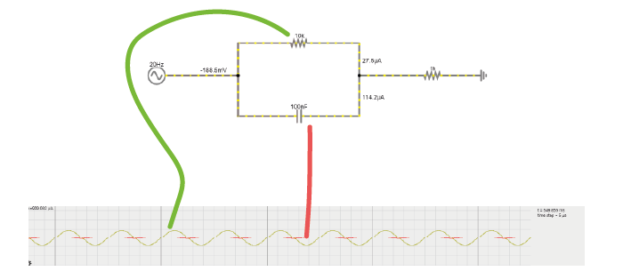
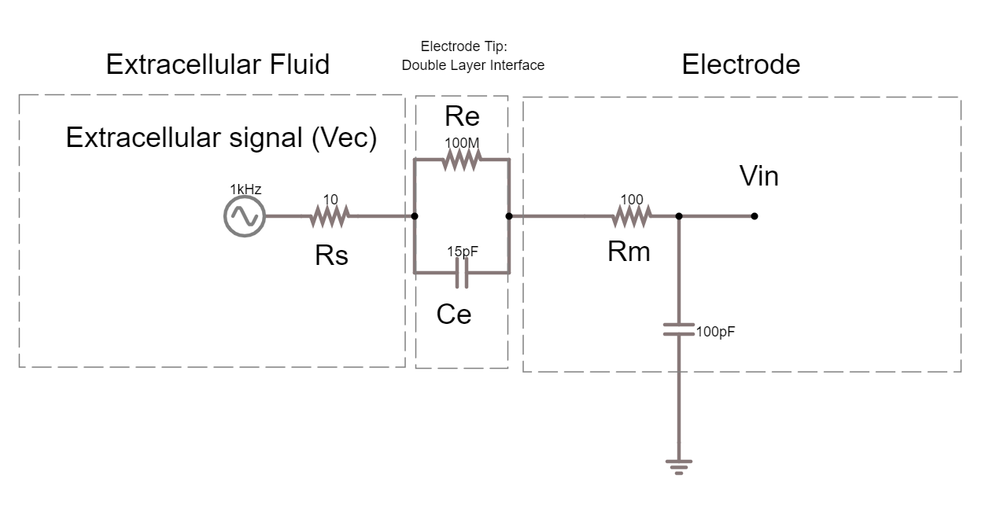
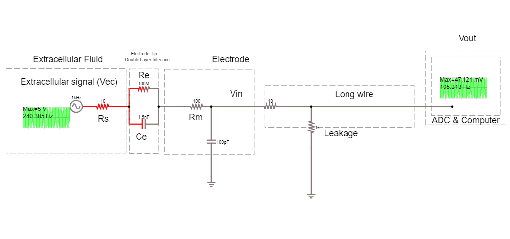

.. _refEDay2TA:

***********************************
Exercises Day 2 TA
***********************************

.. |Ve| replace:: V\ :sub:`e`\
.. |Ce| replace:: C\ :sub:`e`\
.. |Rm| replace:: R\ :sub:`m`\
.. |Re| replace:: R\ :sub:`e`\
.. |Cs| replace:: C\ :sub:`s`\
.. |Vin| replace:: V\ :sub:`in`\
.. |Vec| replace:: V\ :sub:`ec`\
.. |Vout| replace:: V\ :sub:`out`\

.. contents::
  :depth: 2
  :local:

1. Capacitor and Resistor in parallel
#########################################

In the circuit below, you will see a capacitor and a resistor in parallel. The voltage source alternates at 20Hz, going from -10 to +10 volts. The current travels over the resistor or via the capacitor to ground.

.. container:: exercise

  1A.  Increase the value of the resistor to 200kOhm. What happens to the current through the resistor?

  1B.  Put the resistor back to 10kOhm. Now, increase the capacitance of the capacitor to around 10mF. What happens to the current?

  1C.  Return the values to 10kOhm and 100nF.

  Change the frequency of the alternating signal to

  - 1000 Hz (action potentials!)
  - then to 1 Hz

  You may have to change the simulation speed using the red slider at the top right, and adjust the x-scaling of the scope below (right-click / properties / and slide the 'horizontal scale').

  How does the frequency of the signal relate to how much current crosses either the capacitor or the resistor?

.. container:: tabox

  1A. The current over the resistor becomes very small due to the increased resistance. There is a slight increase in current over the capacitor because impedances in parallel impedances diminish (through a reciprocal formula) to form the total impedance. See `here for more info <https://www.allaboutcircuits.com/textbook/alternating-current/chpt-4/parallel-resistor-capacitor-circuits/>`_

  1B. More current travels through the capacitor, its impedance has been reduced.

  1C. High frequencies  = low capacitor impedance = more current through capacitor relative to resistor. At 1 Hz the resistor has a higher max current.

2. The equivalent circuit of the electrode
##############################################

In the theory handout, we discussed how we can represent an electrode as a circuit containing a resistance and a capacitance. We’ll now build this equivalent circuit in the simulator.

.. container:: exercise

    2A.	In the simulator, edit the circuit used above to build the equivalent circuit of a polarised, tungsten electrode. See the theory handout for more details.

    Here are some values to use:

    *	|Rm|: the DC resistance of the metal electrode wire, 10-100 Ohms.
    *	|Ce|: the electrode tip capacitance, generated by the double layer generated around the electrode.  |Ce| ~ 0.2 pF / µm2, so 10 - 20 pF (if the electrode is unplated)
    *	|Re|: electrode tip resistance, in parallel with |Ce|. ~ 100 MOhm.
    *	Edit the alternating voltage supply to provide 1V at 1Khz, mimicking the signal coming from your cell. 1V is larger than ephys signals, but makes the current flow easier to see. Change the sliders for simulation speed and current speed until you can see where the current is flowing.

    2B. What happens if you delete the resistor |Re|?

    2C. Bonus exercise: Can you change this circuit from a polarising, tungsten electrode, to a circuit representing a nonpolarizable electrode?

.. container:: tabox

    2A:  Circuit of electrode: https://tinyurl.com/yzzjjvdk

    .. image:: ../_static/images/EEA/electrode_eq_circuit.png
     :align: center
     :target: https://tinyurl.com/yzzjjvdk

    2B: They should not see much difference if the electrode is only represented by capacitor, because the capacitance of a polarising electrode has the largest effect on the current due to the high resistance of the resistor.

    2C: Reduce the resistance of Re until current can flow through Re.

3.  Shunt Impedance
##########################

Here is the circuit of the electrode with a shunt impedance added of 100 pF:

.. container:: exercise

  3A. What is shunt impedance here?

  3B. What % of our signal are we losing between Vec and Vin? Why?

  3C. What could we change to increase the signal at Vin?

  3D. The tips of certain electrodes, e.g. nichrome tetrodes, can be electroplated in a thin layer of gold. This 'goldplating' increases the surface area of the tip, creating more space to separate charge. This increases tip capacitance by around 100x. Make this change in the circuit simulator. How similar are Vec and Vin now?

.. container:: tabox

   3A: Shunt impedance = Shunt capacitance Csh +  shunt resistance Rsh. These are both routes to ground outside of the intended acquisition system. At the high frequencies (1kHz) we are interested in, the capacitive component will have low impedance, and will therefore have more effect than the resistive component, so Rsh is often ignored. Technically this is just the equivalent circuit of the electrode, so shunt impedance here would be the capacitance along the side of the electrode.

   Remember that any two conducting surfaces, with a non-conducting layer in between, is a capacitor. Shunt capacitance arises mainly from the capacitance across the thin insulation layer isolating an electrode and the surrounding electrolyte, as well as the cumulative capacitance along cables and connectors (Robinson, 1968).

   3B: There should be 655 mV left of our 5V signal. Vec = 5V, Vin = 655mV, we are losing 87% of our signal because the capacitor of our electrode and the shunt capacitance are forming a voltage divider.

   3C:
   We can change the impedance ratio to change the Vin.

   .. math:: Vin = \frac{Zsh}{Ze+Zsh} Vec

   We want Vec to be multiplied by a ratio that is close as possible to 1. We can do that by decreasing Ze (the impedance of the electrode) by *increasing* the capacitance of the electrode. There’s not much we can do to increase Zsh, though in theory that would help; we essentially do this by designing high input impedance amplifiers.

   3D: Gold plated electrode circuit: the increased capacitance decreases impedance.  Circuit here: https://tinyurl.com/y6p3trme. Students can get impedance and capacitance mixed up and forget they go in opposite directions.

Recording Circuit
***********************************
To actually perform a recording, we will have to attach the electrode to the rest of an acquisition system. The recording system has an analog to digital converter (ADC), and a recording computer.  The leakage resistance here is where the recording system is connected to ground.

.. container:: exercise

  3E. How much of the voltage at the electrode, Vec, are we recording at Vout?

  3F. Add a headstage to this circuit, by placing an ideal operational amplifier between the electrode and the long wire. What happens to Vout? Why?

  3G. Change the circuit to stop the amplifier from saturating. What is the amplifier gain now?

.. container:: tabox

    3E:

    - Vec = 1V

    - Vout = 5.027 mV

    - We are recording 0.5%

    3F:

    Place op amp through:

    Menu/Active construction blocks/OpAmp.
    Result: https://tinyurl.com/y68o5n4o
    Some students will already put the negative feedback in here, just make sure they understand why and what happens without it. Without negative feedback:

    Vout hits +- 15V, it is saturating to the value of the power rails, because it has very very high gain. It is calculating the difference between + and - multiplying it by its huge gain.

    3G:

    .. image:: ../_static/images/EEA/sim_headstage_added.png
        :align: center
        :target: https://tinyurl.com/y454jqlb

    We need to do something to prevent our amplifier from always hitting power-rail values. We can provide negative feedback to the amplifier by looping the output back and feeding it into one of the terminals. Connect the amplifier output to the inverting input. The amplifier is going to do the same thing as before; output the difference between + and - multiplied by its huge gain. The output will rise rapidly, however this time, as soon as it reaches the value of the + terminal, the + and – are the same value and there’s no difference left to amplify.

    Now we’re just seeing our input signal replicated at the output of the amplifier with a gain of 1.

4. Operational Amplifiers
###################################

Voltage rails
______________________________________

In the simulator, 'ideal' operational amplifiers are shown without their power supplies. However in real life, we need to provide our op-amp with power. We will use batteries to make voltage ‘rails’. We are going to make a -3V and +3V rail using simulated AA batteries that provide 1.5V each.

To do this we use a common trick and turn two regular power supplies into a bipolar power supply.

.. image:: ../_static/images/EEA/bipolar_power_supply.png
  :align: center

.. container:: exercise

  4D. Using 4x 1.5 DC voltage supplies simulated batteries, connect them together so that you have a +3, 0, and -3 power supply.

  .. image:: ../_static/images/EEA/aa_batteries_sim.png
    :align: center
    :target: https://tinyurl.com/yyo6n35w

  4E. Replace the 'ideal' op-amp with a 'real' op amp in the simulator. Use a bipolar power supply to power it. What amplitude values do you get as output now? How is it different to the ideal op amp?

.. container:: tabox

  4D.

  .. image:: ../_static/images/EEA/bipolar_sim_solution.png
    :align: center
    :target: https://tinyurl.com/yyltu6sb

  4E.

  This is using a single voltage supply to represent each pair of batteries:
  
  .. image:: ../_static/images/EEA/bipolar_supply_sim.png
    :align: center
    :target: https://tinyurl.com/y25z3vzh

Bypass capacitors
***********************************
Bypass capacitors are small capacitors that act like little secondary batteries. The batteries we use have a high ESR - ‘equivalent series resistance’, and some capacitance. This means that are not great at quickly providing current. Because of this, when our op-amp starts working, it can run out of current for a very short time until the battery can drive the rails back to their original voltage. This is bad for the signal quality.

So, we allow these small capacitors to charge. If the battery briefly can’t provide current, the bypass capacitors will discharge, providing quick back-up current. We’re exploiting the fact that these caps have very low ESR and can provide current pretty much instantaneously. The fact that they’re too small to power anything for more than a millisecond does not matter here, at that point the batteries have caught up.

.. container:: exercise

 4F. Add bypass capacitors to the simulation based on where they are in the bipolar power supply pictured here:

  .. image:: ../_static/images/EEA/fritz_bipolar_power_supply.png
    :align: center
    :target: https://tinyurl.com/y25z3vzh

.. container:: tabox

 4F. https://tinyurl.com/yxqwgd9u
