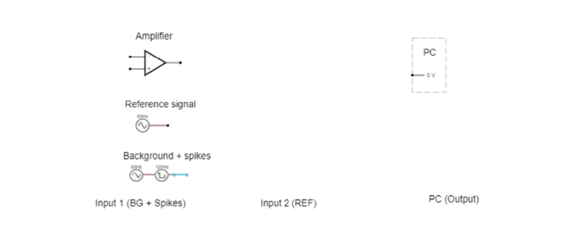
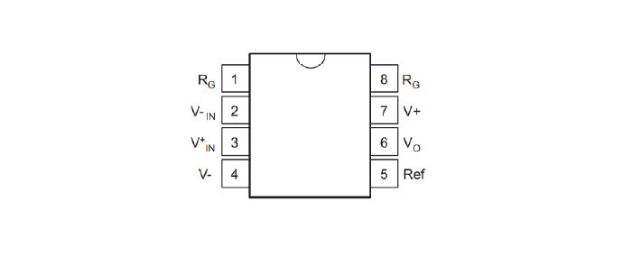

.. _refEDay3:

***********************************
Exercises Day 3
***********************************

.. contents::
  :depth: 2
  :local:

1. Differential Signals
###################################

.. container:: exercise

  1A.	Measure across your fingers with the oscilloscope 1x probe. How big is the amplitude of this signal? Compare this to the size of a spike, around 100 µV.  Could you see a spike on top of that noise?

Reference electrode
***********************************

So far, we have only considered the signal coming into our recording electrode, relative to ground. We will now add a reference electrode in the simulator.

You can think of the small square waves as spikes you are trying to detect, and the sine wave (that both reference and your measurement electrode share) as the background. This background could be slow EEG signals or 50Hz noise, which is likely to be present at both electrodes.

Step-by-step, we are going to build our 'goal' circuit has the following properties:

- Input from a measurement electrode (spikes)
- Input from a reference electrode (common noise)
- Output: Reference subtracted from measurement, multiplied by gain
- Does not draw current from the electrode

.. container:: exercise

  2A. Connect the reference and spike signal directly to the op-amp in open-loop configuration to subtract the reference. Connect the output of the amplifier to the PC. Run the simulation. What (in V) is the amplifier giving as output?

  2B. Try adding a wire (with no resistors) as a negative feedback connection to stop the amplifier from saturating.

  Why does this not work?

  2C. Using two resistors on each side of the '-' input, make a voltage divider.
  What is the output now?

  2D. We're still not outputting our spikes. What went wrong?
  Try to figure this out but talk to a classmate or a TA if you get stuck.

Check that your have a correct differential amplifier circuit before moving on.

.. container:: exercise

  2E. In the simulator we are working with 'perfect' components. In real life, these parts have to be physically produced and have certain degrees of precision, called 'tolerances'. A resistance with 10% tolerance can be 10% higher or lower than the stated value.
  Simulate a case in which one of the resistors is 10% higher and another is 10% lower. What happens?

  |

  Return the resistors to balanced values. Now add resistors directly after the input signals, to act as your electrode (for both the signal and reference). You can simplify the electrode to a 300kOhm resistor, or a 800 pF capacitor if you prefer.

  2F. What happens to the signal if there is a 5% difference between the impedance of your 2 electrodes?
  Can we use this shiny new differential amplifier to record neural signals?

We worked so hard to avoid drawing current from our frail electrode signal, and now we’re telling you to put big voltage dividers right at the inputs of our op-amp? That seems bad.

Also, as we’ve just simulated, often op-amps do not have equal input impedances across + and -! This is similar to the example form earlier where we modelled a long wire, except that now you have two wires of different lengths in front of your inputs. If you've ever measured electrode impedance, how much variation was there between electrodes?

To get this differential amplifier to work, each electrode and resistor would have to be identical, which is, in practice, impossible.

.. container:: exercise

  2G. How can we preserve the nice differential properties of the amplifier we just built, but still have our signals go straight into like a ‘+’ terminal on an op-amp to avoid impedance imbalances, and to avoid drawing current through voltage dividers? Build that circuit.

2. EMG circuit
###################################
We now have all the steps of the acquisition in place to simulate a lab experiment. We are going to build an EMG circuit on the breadboard, using:

- The electrodes in your kit. The disposable electrodes in the kit are single-use, so do not attach them until you are sure your circuit is working and that you have the correct position (see below).
- The electrodes clip onto the cable with three wires. We’ll be using an audio-to-breadboard jack to get the signal from the electrodes into the breadboard.
- An instrumentation amplifier as our 'headstage'. `This <https://www.ti.com/lit/ds/symlink/ina129-ep.pdf?ts=1636717545454&ref_url=https%253A%252F%252Fwww.google.com%252F>`_ is the datasheet for the instrumentation amplifier in your kit.

- We will first test the circuit using the Picoscope to read out the signal. Tomorrow, we will use the Teensy as our acquisition board to digitize the data.

.. warning::
  Your kit contains surface electrodes that we will use for EMG. These measurements involve attaching yourself to a circuit, so follow these rules to be safe:

  A.	Do not use anything other than the recommended batteries to power your circuit. Do not connect your circuit to mains supply for power, ground, anything.
  B.	Only connect the EMG electrodes to one arm. Don’t attach them to both arms. This is to avoid any current travelling across your heart.
  C.	If you are using a laptop, disconnect your laptop charger & run from battery while the electrodes are attached to you. This is to prevent any surges from mains supply from backpropagating through your laptop, to you.

.. container:: exercise

  3A. Replicate the following circuit:

  .. image:: ../_static/images/EEA/eea_fig-62.png
    :align: center

  * Bypass capacitors = '104'
  * Resistor: 220 Ohm

  3B. Now attach the surface electrodes onto the ends of the electrode cable, and click the jack into the breadboard adaptor.

  Each electrode corresponds to a different pin on the breadboard adaptor:

  * Black cable = ground electrode = Ring 1
  * Blue cable = '-' (reference) electrode  = Ring 2
  *	Red cable = '+' electrode = Tip

  3C. Attach your oscilloscope as shown:

  .. image:: ../_static/images/EEA/eea_fig-63.png
    :align: center

  If you tap the electrodes, you should see the trace of your PicoScope respond. If not, troubleshoot your circuit until you do.

Make sure your Picoscope responds to tapping your electrodes before continuing! Ask a TA for help if you get stuck.

.. container:: exercise

  3D.  Place the measurement and reference electrode very close together, on the part of the forearm where you can feel a muscle when tensed. Place the ground on the elbow, where you can feel bone.  You should see a clear signal in the oscilloscope when you tense your muscles. Moving your arm will cause large motion artefacts (why?) so try to find a setup that gives you a consistent and clear signal.

  .. image:: ../_static/images/EEA/eea_fig-78.png
    :align: center

  3E.	The resistor across the instrumentation amplifier sets the gain of the amplifier. Change the gain of the amplifier by changing Rg. What happens when the value for Rg is very low?
