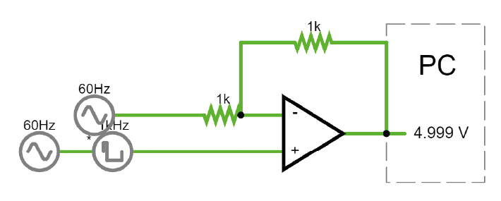
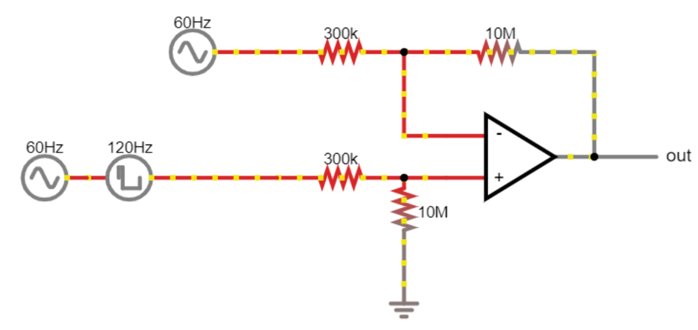

.. _soldiffamp:

***********************************
Differential Amplifier Solutions
***********************************

Negative feedback with voltage divider:

The amplifier is doing whatever it can to keep '-' (the 'virtual ground') at the level of '+'.
The '-' sits in the middle of a voltage divider. The amplifier only has to output current to create spikes at '-'
when they are received at '+'.

To balance the resistors at the '-' input, we need to apply half of the desired signal to the ‘+’ terminal.
How do we do that? As always, with a voltage divider:

Differential amplifier:
https://tinyurl.com/yg63xmm5

With 300kOhm resistors (electrodes):

