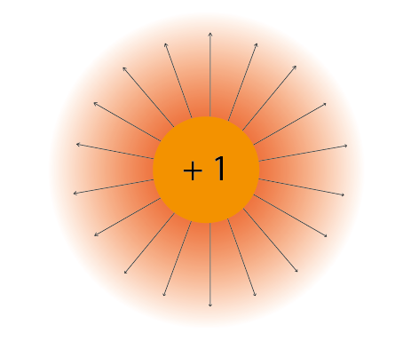
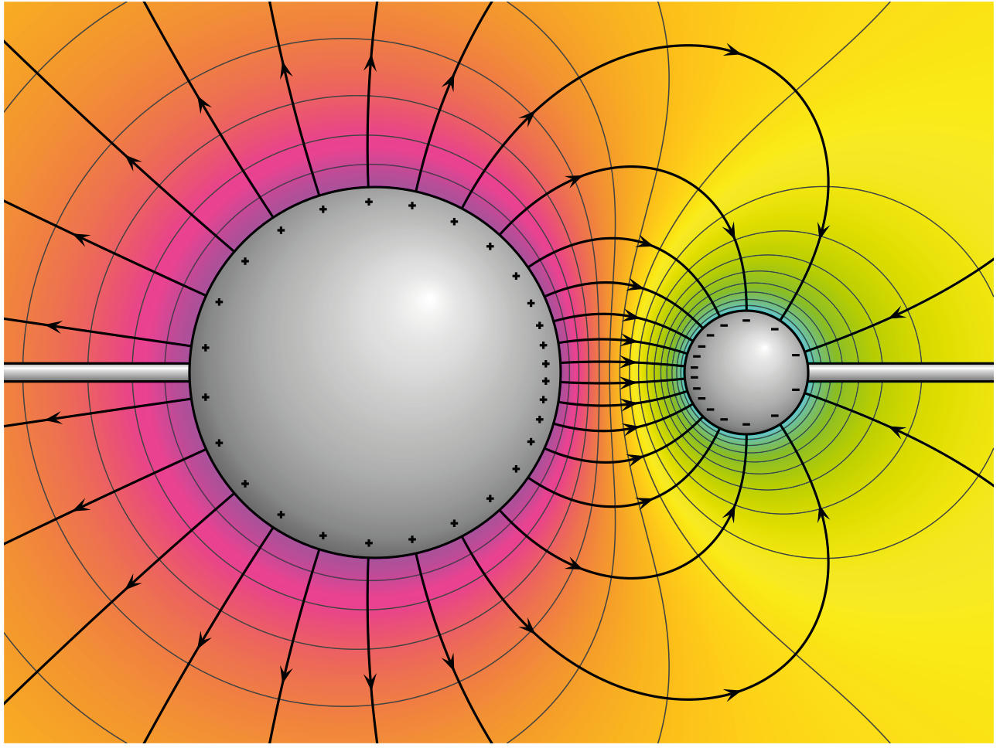
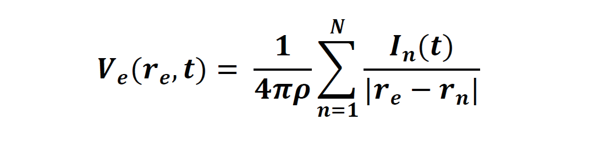
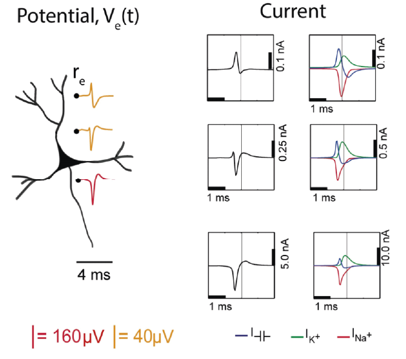
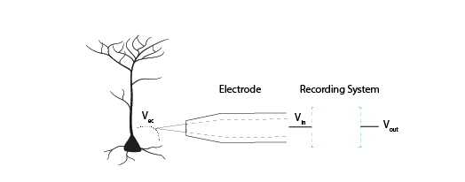
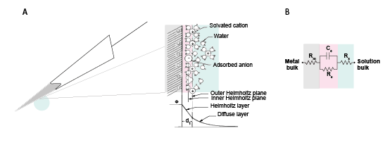
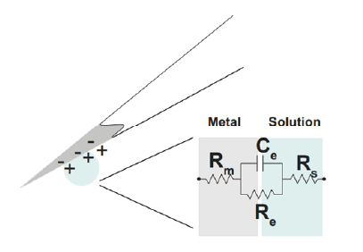

.. _refTDay1:

***********************************
Theory Day 1
***********************************

.. |Na+| replace:: Na\ :sup:`+`\
.. |Cl-| replace:: Cl\ :sup:`-`\
.. |Ca2+| replace:: Ca\ :sup:`2+`\
.. |K+| replace:: K\ :sup:`+`\
.. |Rs| replace:: R\ :sub:`s`\
.. |Rm| replace:: R\ :sub:`m`\
.. |Re| replace:: R\ :sub:`e`\
.. |Rsh| replace:: R\ :sub:`sh`\
.. |Ce| replace:: C\ :sub:`e`\
.. |Csh| replace:: C\ :sub:`sh`\
.. |Vin| replace:: V\ :sub:`in`\
.. |Vec| replace:: V\ :sub:`ec`\
.. |Vout| replace:: V\ :sub:`out`\
.. |Ve| replace:: V\ :sub:`e`\
.. |Za| replace:: Z\ :sub:`a`\
.. |Ze| replace:: Z\ :sub:`e`\

.. contents:: Table of Contents
  :depth: 2
  :local:

Introduction
###################################
Welcome to the Open Ephys Cajal course on extracellular electrophysiology acquisition!

The goal of electrophysiology ('ephys') is to record signals generated by electrically active cells. There are many different
types of acquisition systems and setups, but they are built upon the same principles.
By understanding these fundamental ideas, we hope you will be able to see past branding and tradition, and decide for yourself what
you need your setup to be able to do.

Talk: Introduction
###################################

.. raw:: html

   
  <iframe width="560" height="315" src="https://www.youtube.com/embed/eaAKn61R6MY" title="YouTube video player" frameborder="0" allow="accelerometer; autoplay; clipboard-write; encrypted-media; gyroscope; picture-in-picture" allowfullscreen></iframe>
   

Types of extracellular electrophysiology
############################################
Several biological processes in the body generate electrical signals that we can measure outside of cells, such as skeletal muscle contraction (electromyography, EMG), or the heartbeat (electrocardiogram, ECG). In Neuroscience, we often use intracranial electrodes to measure action potential firing (spikes) or local field potentials (LFP). Electrodes outside the skull allow us to detect the electroencephalogram (EEG) non-invasively.

Most of the theory in this course will focus on intracranial extracellular recordings of neuronal activity, as these are the most common in systems neuroscience. For the practical exercises, we will be building an EMG recording circuit, as it is straightforward to test on yourself.

.. list-table:: Table 1: Overview of Extracellular Electrophysiology Methods
   :widths: 20 25 35 20
   :header-rows: 1

   * - Technique
     - Signal
     - Electrodes
     - Typical amplitude
   * - ECG/EKG
     - Heart: Depolarisation/repolarisation of cardiac tissue
     - Surface electrodes
     - mV range
   * - EMG
     - Skeletal muscle: A train of motor unit action potentials.
     - Surface electrodes placed on skin above muscle, reference electrode on skin above bone.
     - mV range
   * - EEG
     - Brain: Summations of neural activity
     - Surface electrodes on scalp
     - 50 µV
   * - LFP
     - Brain: Summations of neural activity
     - Intracranial electrode
     - 100-1000 µV
   * - 'Spike' recording
     - Brain: Action potentials (‘spikes’) in individual neurons
     - Intracranial electrodes, e.g. tetrodes (4 insulated wires twisted together), Single-wire electrodes, Silicon probes.
     - 20-200 µV

Electronics Refresher
###################################

Charged particles exert electric force
*********************************************
Electric signals in organic tissues are generated by positively charged (Na\ :sup:`+`\, |K+|, |Ca2+|) and negatively charged (|Cl-|) ions. Electrons are the negatively charged particles in our electrodes and wires (i.e., metal) that allow these components to conduct electrical signals.

Charged particles exert an electric force on other charged particles.

.. raw:: html

  

    

     

.. math::

  F= k\frac{q1q2}{r^2}

.. raw:: html

      <h5 class="card-title">Equation 1: F = electric force, k = Coulomb constant, q1 + q2 = charges, r = distance of separation.</h5>
      

    

Coulomb’s law (Eq 1) describes that this force will have both magnitude (it will be bigger if the charges are larger or closer together) and direction (it will either attract or repel, depending on whether the charges have different or the same polarity).

.. image:: ../_static/images/EEA/eea_fig-1.png
  :align: center

.. raw:: html

  
<i> Figure 1: The magnitude of electric force between charges depends on their charge and the distance between them.</i>

We often represent electric force using electric field lines surrounding the particle. These lines show that charges in the vicinity of the particle will be influenced by its force, and that this influence has a particular direction.

.. raw:: html

  
<i> Figure 2: Electric field lines show the direction of the force on a positive charge. Colour intensity represents electric potential</i>

If a charged particle is free to move (for instance, it is an ion in the cytoplasm, and not bound to a membrane) and placed within an electrical field, then these forces acting on it will cause it to move in a certain direction.

Currents are moving charges
*********************************************
Moving charges create a current (I) measured in Ampere. The current tells us how much charge is moving per second.

.. math::

  I = \frac{Q}{t}

.. raw:: html

  
<i> Equation 2: Current (I) is equal to charge (Q) over time (t).</i>

   

By convention, the direction of this current is always the direction of positive charge movement. When we talk about currents generated by a negatively charged ion, such as chloride, we describe it as a positive current moving in the opposite direction to the chloride ion.

.. _refepot:

Electric Potential Difference
*********************************************
To create a current of ions across a membrane, we need a driving force to make them move from point A to point B. That driving force is a differences in electric potential. If free to do so, positive charges will move from areas of high potential to areas of lower potential. Just as a difference in gravitational potential energy can cause a river to flow down a mountain, a difference in electric potential can cause charged particles to flow from a region of higher potential towards a region of lower potential until the charges no longer experience a net electrical driving force.

|

The bigger the difference in electric potential between A and B, the higher the driving force on the charges. If there is no difference in electric potential, no net charges will move (no current). Our driving force is therefore the Electric Potential Difference between two points, measured in Volts and often referred to as 'voltage'. An electric potential difference (V) is the ability to drive a current (I) from point A to B across a resistance (R).

|

Figure 3 shows a negative and positive charge that are held in a certain position in space. They are not allowed to move, but still exert an attracting force on each other. If we let them, they would move towards each other.

.. raw:: html

  
<h5 class="card-title" >Figure 3: Electric potential mapped around a positive and negative charge.
  
 © 2010 Geek3 /CC BY-SA 4.0, commons.wikimedia.org/wiki/File:VFPt_metal_balls_plusminus_potential%2Bcontour.svg 
</h5>

If we placed a +1 'test' charge at any point in this space, it would experience a net electric force; some influence from the + charge, some influence from the negative charge. The vector description of the magnitude and direction of that force is the electric field, and is shown as field lines on Figure 3.

|

The electric potential is different to the electric field. While the electric field has both magnitude and direction, the electric potential only has magnitude, and is represented as colour in Figure 3. High, (orange) positive electric potential surrounds our positive charge, and low (blue) negative potential surrounds our negative charge.

|

If we placed our positive +1 test charge at an area of high potential, like point 'A', it would follow the gradient of the electric potential until it reached the negative particle at point 'B'. The difference in electric potential between point A and B therefore generated a current (a moving charge). We could use that converted potential energy to power something else.

|

In contrast, to move the same particle from point B to point A, we would need to provide additional energy to counteract the repelling force generated by the positive point charge. The difference in electric potential between two points tells us how much energy we need to move a charge from one place to another. If we were to add more point charges (that are not allowed to move) to this image, their generated forces will sum, giving a more complex map of electric potentials at every point in space.

|

Because it is defined as a difference between two points, voltage always has to be measured between two points. When we do extracellular recordings, we measure the electric potential difference between the tip of our electrode and our ground or reference point.

Where is 0 volts?
-----------------------------------------------
To describe the height of a mountain, there is no such thing as absolute altitude; instead, we use ‘sea level’ as our point 0 and measure from there. A similar thing goes for voltage. We pick a point to call ‘0 V’ and compare the rest of the circuit to that. This point can be the negative terminal of a battery, the extracellular fluid, or a point at infinity, far from all sources of electric potential (Einevoll et al., 2013).

|

The terms 'ground', 'reference', and 'earth' are often used interchangeably, but are not quite the same thing.

Reference: A point in the circuit that you labelled 0V, so that you can measure the other values from there.

Ground: Often used as a reference point and considered 0V, but has the additional capacity to provide (source) or get rid of (sink) a lot of current, without its own potential changing.

Earth: The actual earth is the best ground we have. Metal poles in the earth are used to sink current from lightning bolts because the sheer size of the earth means that such a tiny bit of extra current is not a problem, and won't change the potential of the earth.

Resistance
*********************************************
Resistance opposes current flow. If you increase the resistance in a circuit without increasing the electric potential difference, current will be reduced.

This is described by Ohm's law:

.. math::

  I = V/R

.. raw:: html

  
<i> Equation 3: Current (I) is equal to voltage (V) over resistance (R).</i>

   

Capacitance
*********************************************
Capacitors for use in electronics are made of two conducting plates, separated by a thin layer of insulating material that prevents the plates from touching. When a capacitor is connected to a voltage source, such as a battery, charges collect on one of the plates. The charges cannot move through the insulating layer, but they can exert a force through it. This electric force pushes away similar charges on the opposite plate. This movement of charge is what gives us current flow in the circuit, even though charges cannot flow directly through the capacitor.

.. math::

  Q = C * V

.. raw:: html

  
<i> Equation 4: The amount of charge (Q) a capacitor can separate depends on is its capacitance (C, measured in farads) and the voltage (V) across the capacitor.</i>

   

  An uncharged capacitor has no net charge on either plate (left). A charged capacitor separates charges with positive charges on one plate, and negative charges on the other (right).

In a direct current circuit, current will flow while the capacitor charges, as charge is pushed or pulled on either plate. Current flow will stop once the capacitor is fully charged. This electric charge can be discharged (and, for instance, used to power something) by providing a path that connects the positive and negative charges of the capacitor.

.. _refimpedanceintro:

Impedance
*********************************************
Unlike a battery, which provides current flow in only one direction, our neuronal currents can move both towards and away from our measuring electrode. Neuronal signals are therefore **alternating signals**. The **frequency** of an alternating signal tells us how often the direction of flow changes. The power supply in buildings is also alternating: the current direction switches at a fixed frequency, producing a sinewave (the notorious 50/60Hz noise in ephys recordings).

|

In alternating signal cases, we need to use impedance (Z) to describe opposition to current flow, instead of using resistance. The impedance represents opposition to current flow measured in both magnitude and phase, which allows us to describe the relationship between voltage and current for time-varying signals. We can measure the impedance of a component at different frequencies, so that we understand both the magnitude and phase relationship between V and I over a broad frequency range (from 1 Hz to 10 kHz). Let’s examine the response of resistors and capacitors to an applied sinusoidal voltage (an alternating signal).

Impedance: Resistors
-----------------------------------------------
For resistors, the impedance magnitude (Z) is constant and does not vary with the frequency of signal applied. The impedance follows Ohm's Law (V = IR), which doesn't take the frequency of the signal into account.

Impedance: Capacitors
-----------------------------------------------
In contrast, for a capacitor, the current is 90° out of phase with the voltage, and the magnitude of impedance decreases as the frequency increases. We can therefore only describe the impedance of a capacitor at a certain frequency.

.. math::

  Zc = \frac{1}{2 \pi fC}

.. raw:: html

  
<i> Equation 5: The magnitude of impedance of a capacitor (Zc) will decrease with increasing frequency (f). The larger the capacitance (C), the lower the impedance at a specific frequency.</i>

   

Equivalent circuits in the brain
############################################
Let's apply the electronics concepts above to our neuronal tissue. Neuronal activity relies mainly on ions such as |Na+|, |K+| and |Ca2+|. Whenever these charges flow, we have a **current**. In neurons, our **resistance** to current flow is largely formed by the permeability of the cell membrane to our ion, and changed by opening or closing ion channels in the membrane. When more channels open, the resistance to a certain ion is lowered, and the charge is able to flow in or out of the cell.

|

The driving force in this scenario is the membrane potential, i.e. the **difference in electric potential** between the inside of the cell membrane and the extracellular fluid. A neuron typically has a resting membrane potential of around -70 mV compared to the extracellular fluid, if we decide that the extracellular fluid has 0 V.

|

Ions in neurons are influenced by electric forces and a second driving force, namely their concentration gradients. Ions will tend to diffuse away from areas where there is a high concentration of the ion, to areas with a lower concentration. The interaction of the concentration and electrical driving forces is the electrochemical gradient and this balance is described by the Nernst equation. Read `Wright 2004 <https://journals.physiology.org/doi/pdf/10.1152/advan.00029.2004>`_ for a clear refresher on this, and to understand how the -70mV is maintained by the cell.

Neuronal output: Action Potentials
*********************************************
Input signals to the neuron can trigger the opening of voltage-dependent |Na+| ion channels, greatly reducing membrane resistance to |Na+|. This allows |Na+| to follow its concentration and electrical gradient, an travel from outside the cell, where the |Na+| concentration is high, to the inside of the cell, where |Na+| concentration is low and the intracellular medium has a lower potential (Kandel, Schwartz, & Jessel, 2000). In neurons, voltage-sensitive |Na+| channels are usually concentrated at the initial segment of the axon, and it is therefore more likely that an action potential will be generated there, rather than in other regions of the cell. The subsequent opening of |K+| channels begins the process of returning the membrane potential to resting conditions (Hodgkin and Huxley, 1939).

Neuronal input: Postsynaptic potentials
*********************************************
Slower frequencies in extracellular recordings are the focus of the LFP or EEG. These are thought to be largely generated by postsynaptic potentials, as these occur over slower timescales (10s of ms) than the action potential (1-2 ms), so there is more opportunity for signals from multiple cells to summate and result in larger signals. When activated, AMPA and NMDA synapses mediate excitatory currents as |Na+| and |Ca2+| enter the cell.

Capacitors in the brain
*********************************************
The definition of a capacitor was described above. This configuration of two conducting materials separated by a thin, insulating layer, does not only happen in specifically designed electronics components, but can occur anywhere. One example is the neuron, where both the intracellular and extracellular medium are conductive, but the cell membrane is not. The cell membrane is therefore also a capacitor, and charge can be separated along the membrane depending on the potential difference between the inside and the outside of the cell.

Remember that:

.. math::

  Q = C * V

The amount of charge (Q) a capacitor can separate depends on is its capacitance (C, measured in farads) and the voltage (V) across the capacitor. That means that when the voltage across the cell membrane is reduced (i.e. the cell depolarises), the ability for the membrane to store charge is also reduced. These charges are released from the membrane and generate the capacitive current (see below).

Importantly for acquisition systems, cables are capacitors too; imagine a cable containing two wires. These wires are conductive, and are separated by a thin layer of insulation. These wires will separate and release charge depending on the electric potential difference between them.

Extracellular measurements
*********************************************
When we perform extracellular recordings, we are measuring the electric potential induced at the electrode (V\ :sub:`electrode`\ or |Vec| ) by these currents. The effect on the induced electric potential depends on the magnitude, sign and location of the current sources, and on the conductivity of the extracellular medium (Buzsaki et al., 2012; Nunez and Srinivasan, 2006). The effect of these currents diminishes with distance, depending on how well the extracellular fluid conducts electricity. The extracellular potential Vec at position re, with respect to a point at infinity, can be computed with the following equation (Einevoll et al., 2013; Nunez and Srinivasan, 2006):

.. raw:: html

  
<i> Equation 6: The point source equation.</i>

Conceptually, this point-source equation (Equation 6) is key for computing the extracellular potential in response to any transmembrane current (Buzsaki et al., 2012). In(t) represents the nth point current source and re – rn  represents the distance between the point source and the position of measurement, with n = 1...N, where N is the number of individual point sources and ρ is the extracellular conductivity. If the extracellular medium is considered homogeneous and isotropic, we can use a constant conductivity value for the extracellular fluid (Einevoll et al., 2013).

|

Extracellular action potential waveforms usually last on the order of 1-2 ms, and are in the range of tens to hundreds of microvolts in amplitude, with the largest potential deflections being detected close to the soma of a neuron. These stereotypical temporal deflection of the electric potential in the extracellular space are called action potentials or spikes. The model in Fig 5 below illustrates how the electric potential varies depending on electrode location relative to an active neuron.

|

Fig 5 depicts the (modelled) time-varying extracellular potential measured at 3 different locations close to a neuron. Each extracellular waveform results from the superposition of ionic and capacitive transmembrane currents. The peaks in the potential waveforms correspond to the current (right column) that is dominant at that time-point: the first positive peak of the waveform is attributed to the positive capacitive current resulting from the strong |Na+|  current entering the axon initial segment; the main negative peak is attributed to the influx of |Na+|; and finally, the second positive peak results from repolarizing |K+| current flowing out of the cell (Gold et al., 2006). As the effect of a current decreases with distance, the relative position of the electrode determines the relative contribution of each current and therefore the net overall current shape (left column). For instance, if the electrode is close to the axon initial segment (where many voltage-dependent |Na+| channels are), the |Na+| current will be larger.

.. raw:: html

  
<h5 class="card-title" >Figure 5: Electric potential generated by current sources in a conductive volume.
    
  Electric potential generated by current sources in a conductive volume. The extracellular potentials and currents are adapted from Gold et al., 2006. The shape of the extracellular potential waveforms at various spatial positions 're' (marked with black dots) are simulated for a CA1 pyramidal neuron.
    Currents: simulated net membrane current (first column) across the soma and proximal dendrites that best estimates the extracellular potential waveform and membrane current components in terms of Na+, K+ and capacitive currents (second column). In the soma, the positive capacitive current coincides with the larger Na+ current. At locations along the apical trunk, the initial capacitive peak becomes visible. In dendritic compartments the membrane depolarization is initially driven by Na+ current from the soma, until local Na+ currents are activated and the action potential regenerates. In the brief time before the local Na+ currents activate, the positive capacitive current is the dominant membrane current and a capacitive-dominant phase is visible in the net current (Gold et al., 2006, adapted by Joana Neto).
</h5>

What does an acquisition system do?
##################################################
There are several things that any extracellular acquisition system has to be able to do. Here is a quick overview so that you can start to imagine what the acquisition system does, but don't worry if they don't make sense yet. We will go through each of these points carefully during the course.

|

The extracellular electrophysiology techniques in Table 1 all share the same major goal: to measure activity occurring in biological tissue. They do that by detecting changes in electric potential due to cellular activity, compared to a reference or ground point, and by faithfully shuttling these signals to an output where the experimenter can view or record them. In most cases this output will be a computer where we can visualise and store our data.

|

The signal at the electrode is measured in volts (V) and is very small, in the microvolt range. This is tiny compared to the voltages we encounter elsewhere in the lab: for instance, a battery is around 3V, and the building main power supply  120 or 230V. The world, and your lab, is also an electrically noisy place, which you will know if you have done any ephys before. Electrical equipment, communications devices, but also just walking around (static electricity) creates electric potential differences many orders of magnitude larger than the biological signal you are trying to measure. The acquisition system needs to be designed so that it can detect our tiny signals even in the face of surrounding noise signals generated by other sources.

  Figure 6: The voltage at the electrode tip (Vec), the voltage after the electrode (Vin) and the voltage we read out (Vout). We can only read Vout, and must design our acquisition system so that it is as similar to Vec as possible.

To know what is going on in our cells, we need as much as possible of the signal at the electrode tip (|Vec|) to make it through the electrode (|Vin|) and acquisition system and arrive at our output (|Vout|). If we lose signal magnitude, or lose certain frequencies because of the way our acquisition system is designed, we may miss important data or come to wrong conclusions about our cells. We therefore have to design our acquisition system to pass on signals as faithfully as possible, losing little signal to the environment.

An acquisition system must therefore:

* **Detect changes in electric potential difference**
* Faithfully *transfer* this signal to our acquisition system output
* Distinguish interesting biological *signals* from other sources of electrical *noise*

The electrode detects changes in electric potential
#####################################################
Getting from neuronal activity (|Vec|) to the input to the recording system (|Vin|) relies first on the interface between the electrode and the extracellular space. Extracellular microelectrodes are usually made from metallic conductors. A thin insulated metal wire with an exposed tip is the most basic, and still widely used, device for in vivo extracellular recording from brains. Metals such as platinum, gold, tungsten, iridium, titanium nitride, stainless steel, iridium, iridium oxide, and alloys, nickel-chrome, platinum-iridium and platinum-tungsten have all been used in neural electrodes.

|

The transition from ion flow in the extracellular space (neural activity) to electron (electrode) flow is made through the double layer interface. When a metal is placed in a saline solution two phenomena occur: water dipoles close to the metal surface become oriented, and assuming the metal surface is negatively charged, the solution close to the metal surface become depleted of negative ions (anions), leaving behind a cloud of positive ions (cations). This cloud of cations screens the electric field caused by the excess of charge on the metal. Electroneutrality across the interface requires that the charge on the metal is always equal and opposite to the total charge on the solution side of the interface (Musa et al., 2012). The resulting charge distribution - two narrow regions of equal and opposite charge - is known as the electrical double layer (EDL). The double layer region (represented in pink in the schematics) has the ability to separate charges on both sides, and therefore a capacitance '|Ce|'. The double layer also opposes the direct flow of current across it, and therefore has a resistance '|Re|'.

.. raw:: html

  
<i> Figure 7: The double layer interface between an electrode and the extracellular fluid.</i>

We can describe the electrical behaviour of electrodes by making an ‘equivalent circuit’, getting rid of the specific shape or material and just representing the electrical properties of the double layer interface:

.. raw:: html

  
<i> Figure 8: The equivalent circuit describes the electrical properties of the double-layer interface between electrode and extracellular fluid.</i>

In the above figure, the double layer interface between the solution and the electrode is represented by a parallel resistance and capacitance, in combination with resistances |Rm| (metal) and |Rs| (solution) in series.

* |Re| represents leakage resistance of the electrode; the charge transfer due to charge carriers crossing the electrical double layer.
* |Ce| is the capacitance of the electrical double layer at the interface of the exposed metal and the solution.
* |Rm| (metal) is the resistance within the electrode itself, which depends on what the electrode is made of.
* |Rs| (solution) is the resistance of the fluid surrounding the electrode.

Because the resistance of the extracellular fluid |Rs| is small and independent of the electrode or acquisition system, we often simplify our equivalent circuits by leaving this value out.

There are two general types of electrode, ‘non-polarised’ and ‘polarized’. Each has a different mechanism through which ion flow in the solution leads to electron flow in the electrode.

Non-polarized electrodes
*********************************************
The well-known silver-silver chloride (Ag-AgCl) electrode approaches the ideal nonpolarizable type. In these ‘charge transfer’ electrodes, surface-confined species are oxidized and reduced (Bard & Faulkner, 2001, Merrill et al., 2005). Non-polarizable electrodes have a small |Re|, allowing charge-transfer across the electrode-solution interface. If Re is small, it bypasses the capacitor |Ce|, thus providing a direct path for the measurement of steady potential levels.

Polarized electrodes
*********************************************
The tungsten microelectrode is considered a ‘polarized’ electrode. Polarized electrodes have large |Re| values, in the order of several megaOhms, and so they resist direct flow of charges across the double layer. Instead, the transition from ion flow in the solution to electron flow in the electrode is capacitive. The double layer will separate charges, with negative charges inside the electrode and positive charges on the side of the extracellular fluid holding each other in place. When cellular activity causes a redistribution of ions in the extracellular fluid, the resulting increase or decrease in attractive force will recruit or release electrons in the electrode. Either direction, a current will flow inside the electrode.

Therefore, processes in polarizable electrodes are purely electrostatic and caused by the charging and discharging of the double layer capacitance. Although charge does not cross the interface, currents inside the recording system can flow when the potential or solution composition changes (Cooper, 1971).

To give an example of a polarized electrode, a tungsten microelectrode like the one used by Hubel and Wiesel in the 1950’s and 60’s has:

* |Ce| ~ 0.2 pF / um2 ~ 10 - 20 pF (unplated)
* |Re| ~ 10 to 100 MOhm.
* |Rm| ~ 10 to 100 Ohm (Rm= (resistivity x length)/ cross sectional area)

References
###################################
Bard, A. J., & Faulkner, L. R. (2001). Electrochemical methods Fundamentals and Applications. Molecular Biology (Second, Vol. 8). John Wiley & Sons, Inc.

Buzsaki, G., Anastassiou, C.A., and Koch, C. (2012). The origin of extracellular fields and currents - EEG, ECoG, LFP and spikes. Nat Rev Neurosci 13, 407–420.

Defelipe, J., Alonso-Nanclares, L., and Arellano, J. (2002). Microstructure of the neocortex: Comparative aspects. Journal of Neurocytology 31, 299–316.

Einevoll, G.T., Kayser, C., Logothetis, N.K., and Panzeri, S. (2013). Modelling and analysis of local field potentials for studying the function of cortical circuits. Nature Reviews Neuroscience 14, 770–785.

Gold, C., Henze, D.A., Koch, C., and Buzsáki, G. (2006). On the Origin of the Extracellular Action Potential Waveform: A Modeling Study. Journal of Neurophysiology 95, 3113–3128.

Herculano-Houzel, S. (2009). The human brain in numbers: a linearly scaled-up primate brain. Front. Hum. Neurosci. 3.

Hodgkin, A.L., and Huxley, A.F. (1939). Action Potentials Recorded from Inside a Nerve Fibre. Nature 144, 710–711.

Kandel, E.R., Schwartz, J.H., and Jessel, T.M. (1991). Principles of neural science.

Markram, H., Muller, E., Ramaswamy, S., Reimann, M.W., Abdellah, M., Sanchez, C.A., Ailamaki, A., Alonso-Nanclares, L., Antille, N., Arsever, S., et al. (2015). Reconstruction and Simulation of Neocortical Microcircuitry. Cell 163, 456–492.

Merrill, D.R., Bikson, M., and Jefferys, J.G.R. (2005). Electrical stimulation of excitable tissue: design of efficacious and safe protocols. Journal of Neuroscience Methods 141, 171–198.

Meyer, A.C., and Moser, T. (2010). Structure and function of cochlear afferent innervation. Curr Opin Otolaryngol Head Neck Surg 18, 441–446.

Musa, R. (2011). Design, fabrication and characterization of a neural probe for deep brain stimulation and recording.

Musa, S., Rand, D.R., Cott, D.J., Loo, J., Bartic, C., Eberle, W., Nuttin, B., and Borghs, G. (2012). Bottom-Up SiO2 Embedded Carbon Nanotube Electrodes with Superior Performance for Integration in Implantable Neural Microsystems. ACS Nano 6, 4615–4628.

Nelson, M.J., Bosch, C., Venance, L., and Pouget, P. (2013). Microscale Inhomogeneity of Brain Tissue Distorts Electrical Signal Propagation. J. Neurosci. 33, 2821–2827.

Nunez, P.L., and Srinivasan, R. (2006). Electric fields of the brain: the neurophysics of EEG (Oxford ; New York: Oxford University Press).

Obien, M.E.J., Deligkaris, K., Bullmann, T., Bakkum, D.J., and Frey, U. (2015). Revealing neuronal function through microelectrode array recordings. Front. Neurosci. 8.

Ray Cooper. (1971). Recording Changes in Electrical Properties in the Brain in Methods of Psychobiology. (R. D. Myers, Ed.) (Volume 1). London and New York: Academic Press.

Wright, S. (2004). Generation of resting membrane potential. Adv Physiol Educ. 28: 139-142.
