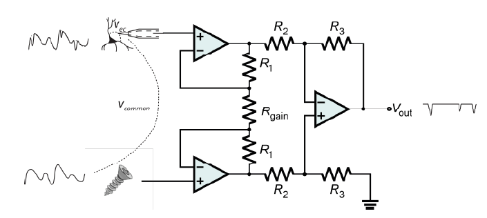
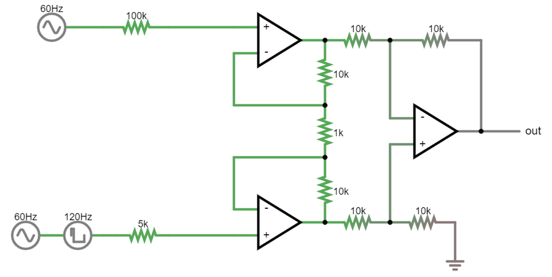
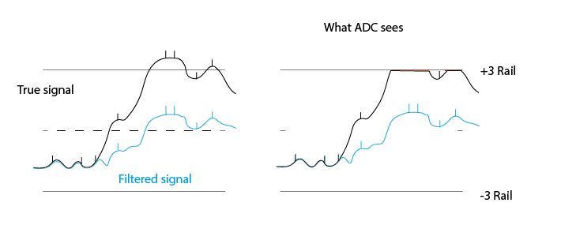
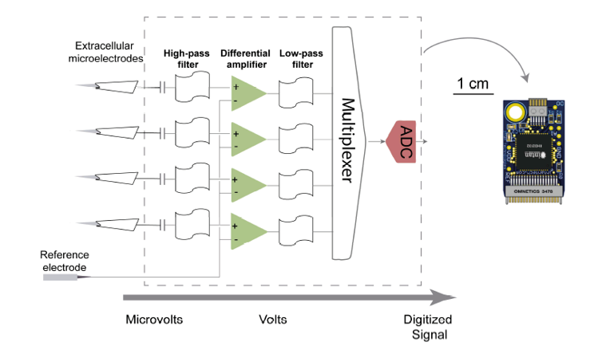
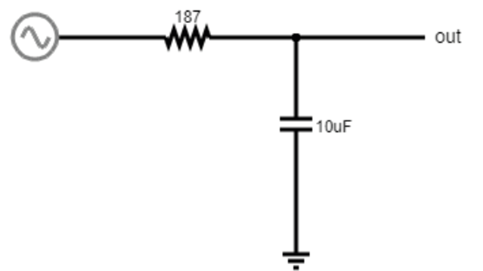
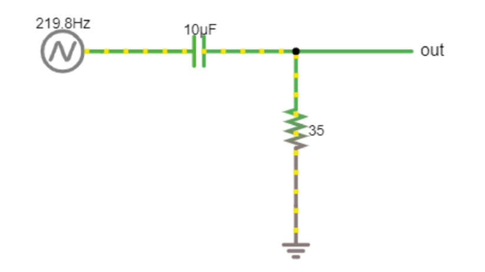

.. _refTDay3:

.. |Na+| replace:: Na\ :sup:`+`\
.. |Cl-| replace:: Cl\ :sup:`-`\
.. |Ca2+| replace:: Ca\ :sup:`2+`\
.. |K+| replace:: K\ :sup:`+`\
.. |Rs| replace:: R\ :sub:`s`\
.. |Rm| replace:: R\ :sub:`m`\
.. |Re| replace:: R\ :sub:`e`\
.. |Rsh| replace:: R\ :sub:`sh`\
.. |Ce| replace:: C\ :sub:`e`\
.. |Csh| replace:: C\ :sub:`sh`\
.. |Vin| replace:: V\ :sub:`in`\
.. |Vec| replace:: V\ :sub:`ec`\
.. |Vout| replace:: V\ :sub:`out`\
.. |Ve| replace:: V\ :sub:`e`\
.. |Za| replace:: Z\ :sub:`a`\
.. |Ze| replace:: Z\ :sub:`e`\

***********************************
Theory Day 3
***********************************

.. contents:: Table of Contents
  :depth: 2
  :local:

|

An acquisition system must:

* *Detect* changes in electric potential difference
* Faithfully *transfer* this signal to our acquisition system output
* **Distinguish interesting biological signals from other sources of electrical noise**

Differential amplifiers remove common noise
#########################################################
Referencing
**************************************
We live in an (electrically) very noisy world. To get rid of some of this noise from our recording, we can use a reference, which can be another electrode in the brain or a screw in the animal’s skull. The choice you make here is very important for your recording: the amplifier will output the difference between your recording electrode and your reference point. That means that the amplifier will do its best to get rid of any signal that the two share. If the recording electrode is picking up 50 Hz noise generated by the mains power supply in the walls, you want the amplifier to get rid of it, so it’s best to use a reference point that will also pick up this noise. However, if your reference is picking up signals that you are interested in, the amplifier will get rid of those too. To choose an appropriate reference, you have to decide what qualifies as noise in your experiment.

Differential Amplifiers
**************************************

Talk
***********************************

.. raw:: html

  
<iframe width="560" height="340" src="https://www.youtube.com/embed/91SVSdoEFzU" title="YouTube video player" frameborder="0" allow="accelerometer; autoplay; clipboard-write; encrypted-media; gyroscope; picture-in-picture" allowfullscreen></iframe>

The amplification of the potential difference between the measuring electrode and the reference electrode (in the order of microvolts) is a crucial step. This is accomplished with differential amplifiers that amplify the difference and rejecting the 'common-mode' noise (i.e., noise identical in the recording and reference electrodes typically caused by motion artifacts and capacitive coupling of the body and electrode lead with power line fields (Nunez & Srinivasan, 2009)).

Instrumentation amplifiers
#########################################################

Talk
***********************************

.. raw:: html

   
  
<iframe width="560" height="340" src="https://www.youtube.com/embed/uPcv0gBjqbA" title="YouTube video player" frameborder="0" allow="accelerometer; autoplay; clipboard-write; encrypted-media; gyroscope; picture-in-picture" allowfullscreen></iframe>

   

Why do we need Instrumentation amps?
*************************************

Why can't we just use 1 operational amplifier to get a nice signal?

.. image:: ../_static/images/EEA/eea_fig-49.png
  :align: center
  :target: https://tinyurl.com/y4aps4r2

To make this circuit differential, we need voltage dividers. But these are connecting our fragile signal to ground! Plus, any mismatch in the input impedances between ‘+’ and ‘-’ messes up the signal if there is a lot of common mode noise. In practical terms, there is always going to be a mismatch between these resistors, they simply cannot be produced in a way that makes them exactly equal.

Why? Because this resistor is *also your electrode*. If you work with electrodes, have you measured their impedances? How similar are they? If you made these resistors as different as your electrodes are variable, this circuit will not work to eliminate common mode noise and amplify our spikes.

The solution is to use *three* op-amps:

|

Here it is in the simulator:
|

Gain resistor
-----------------------------------
The voltages on either side of the gain resistor are fixed, because the op-amps are keeping them in place. If we have the same V and lower RGain = more current must travel through the resistor, and therefore more current through the feedback resistors of the two buffer op-amps. Those are fixed resistors: now we have a higher I for same R and therefore a higher voltage drop across these resistors. Both buffer op-amps now have to work harder to overcome this voltage drop and will output more extreme voltages. By decreasing the value of RGain, we are basically making the inputs to the final op-amp more different to each other, and therefore increasing the gain of the instrumentation amp.

Common mode rejection ratio (CMRR)
***********************************
When the input impedances of the differential amplifier weren’t matched, part of the input signal that was common to both inputs, and thus should be cancelled out, actually appeared in the output. A common way to model how well an amplifier subtracts one input to the other is the following:
We define each input (+ and -) to be a sum of an individual voltage (V1 or V2) plus a voltage common to both. In our arms, or the brain of an animal, this common voltage (Vc) could be electrical noise or muscle activity we are not interested in and want to discard. In this case, the inputs would be:

.. math::
  V+ = V1 + Vc
.. math::
  V- = V2 + Vc

(In some examples of a differential amplifier, V2 is ground 0V, which is a perfectly valid value). In an **ideal** differential amplifier, the output should be the difference of both amplified by a factor:

.. math::
  Vout = Ad (V+ - V-)

.. math::
       = Ad ((V1+Vc)-(V2+Vc))

.. math::
       = Ad (V1-V2)

Where Ad is the differential gain, the factor by which the differential signal is amplified.
Here, the unwanted, common signals cancel out and only the signal we are interested in is amplified.

A **real** amplifier, however, acts in a different way. As we’ve seen, small imperfections can lead to part of the common voltages being amplified as well. In this case, the output of a real amplifier ends up being:

.. math::

  Vout = Ad (V1 - V2 ) + Ac * Vc

In addition to the differential gain, a new term  'Ac', or common gain, appears. This amplifies the signal common to both inputs. Of course, we want an amplifier to have a differential gain as high as possible and a common gain as low as possible (ideally, Ac would be 0). The relation between these two gains tells us how good an amplifier is at amplifying only the differential signals. This is called the Common Mode Rejection Ratio, or CMRR, simply defined as

.. math::
 CMRR = \frac{Ad}{Ac}

or

.. math::
 CMRR = 20log\frac{Ad}{Ac}

if measured in decibels.

The higher the CMRR, the better the amplifier is at cancelling out the signals common to both inputs.
Instrumentation amplifiers are not completely immune to common input noise. They are real circuits and, as such, there are multiple ways for these common signals to bleed out into the output. They have, however, a very high CMRR. Comparing the two devices we’ve been using, the operational amplifier LM358 has a CMRR of 80dB while the instrumentation amplifier has a CMRR of 120dB, 100 times higher! (Sounds underwhelming? Remember decibels are logarithmic; the difference between 80 and 120 dB in terms of sound is the difference between a toilet flushing and a jet engine).

.. _refgroundref:

Why do we need a ground electrode?
###################################

When we build our EMG circuit, we will use three electrodes: measurement (+), reference (-), and ground. Why do we have a ground electrode (or ground pin or screw) when we already have ‘+’ and ‘-’ inputs? This is a bit tricky, and there's multiple ways to understand it.

.. raw:: html

     
    
<iframe width="560" height="340" src="https://www.youtube.com/embed/YE2cdXtzlF4" title="YouTube video player" frameborder="0" allow="accelerometer; autoplay; clipboard-write; encrypted-media; gyroscope; picture-in-picture" allowfullscreen></iframe>
    

     

Imagine you just walked across a carpet and you're charged to 10kV. Now you want to do a differential measurement of EMG (or EEG). In theory, as far as we've really talked about until now, this should work via the magic of common-mode rejection. However, remember the circuit that is inside the instrumentation amp:

The ‘-’ inputs of the two input op-amps are connected to ground, via a bunch of resistors. If you are charged to 10kV compared to Ground, we’re asking these op-amps to deal with very high differences in voltage, and they will saturate. Even if here we did not include rails in the simulation, remember that each op-amp can only go as high or low as its voltage rails (3V in our case, so with a 100x gain, a 0.03V input saturates the amplifier).

|

Remember the common mode rejection ratio. If our amplifier is good at rejecting 99.99% of the common mode, but 0.01% makes it through, in the range of volts, this could still be enough to prevent us from resolving microvolt spikes.

|

Attaching a ground electrode to ourselves, and then connecting this to the ground of our acquisition system, brings our body to 0V from the perspective of the acquisition system. The remaining noise fluctuations are still there, but the voltage difference is not as big anymore. We will still have residual 50 or 60Hz noise from the mains supply, plus other muscles, electrostatic charge, bodies moving through the fields in the room and so on, but these can all be handled by the amplifier.

|

The last, related, issue is that the output of the whole thing is relative to ground. At some point you want to connect this to a PC, which sits at ground level.

|

Practically, all this means that we want to ground our subjects as well as possible. For tetrode recordings in mice, we use a large ‘ground screw’ with low impedance to ground, so that we can effectively discharge the mouse.

|

One more detail: Ground is not (always) earth, in many cases it is just a certain circuit we treat as 0 that can provide or sink a lot of current. That circuit can have noise on it, just like any other circuit. If the ground has a lot of 50/60Hz noise, we’ll be charging and discharging the animal (any animal is also a capacitor) constantly through the ground connection. If the ground screw/electrode is low enough impedance and close to our recording site, we’ll manage to keep the animal’s voltage equal to the changing GND level and we won't notice this noise. However, if we put the ground screw/electrode too far away from where we record, e.g. we put the ground connection on the tail (extreme example), then the head of the animal won’t be sufficiently charged/discharged and we’ll encounter what will look like 50/60Hz noise in our tetrode recordings.

.. _reffilter:

Low and High pass filtering
###################################
Filters are used to remove certain frequencies from our data. We can do this in hardware or in software. Usually hardware filtering (implemented in the amplifier circuit) is used to increase (apparent) signal to noise ratio by rejecting unwanted frequencies and to prevent signal aliasing (e.g., bandpass between 0.5 and 2 kHz).
Remember the exercise where we measured the voltage across our fingers with the oscilloscope, and saw very high values. Even with a differential amplifier, we usually have a decent amount of slow (~<10Hz or so) voltages that are simply too big for the amplifier or ADC (analog to digital converter). Any voltages above or below the amplifier rails (or above/below the input range of the digitizer) will be ‘clipped’ and all we’ll see is a constant value.
The solution is to remove the large amplitude slow components, so we can fit the lower amplitude, faster, interesting components into our dynamic range.

Therefore, high-pass filters first remove the large DC offsets present at the electrode-extracellular interface, along with any undesired low-frequency signals (e.g., movement artefacts). Additionally, low-pass filters must be configured to less than half of the ADC frequency sampling rate (Nyquist limit) to prevent aliasing, and may also be used to block undesired high-frequency signals and artefacts. For instance, if our sampling frequency is 30 kHz, the low pass filter should be ~15 kHz. Below is an example of the Intan headstage circuit.

Low-pass filters
***********************************
These filters block high frequencies. This is basically another voltage divider, with a frequency-dependent component. You’ve already seen one of these when you charged/discharged a capacitor! The exponential decay of the capacitor gets convolved with our signal. Remember that the impedance of our capacitor decreases as the signal frequency increases. At low frequencies, the high impedance of the capacitor means we get a large voltage drop over the capacitor, and more of our input signal can reach our Vout.

High-pass filters
***********************************
This is the same `idea. <https://www.falstad.com/circuit/e-filt-hipass.html>`_
With increasing signal frequency, the impedance of the capacitor decreases (day 1), reducing the voltage drop over the capacitor and sending more signal to the output.

These are called ‘RC filters’ because they’re built from a resistor (R) and a capacitor (C). Because there's only one of each, we call them ‘single pole’. In real life, filters are built from more than one pair in order to get specific characteristics. This goes beyond the scope of this course but there are entire classes on this topic.
