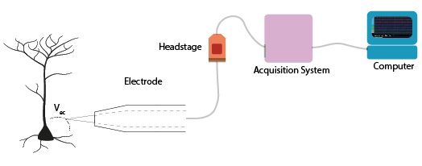

.. notoc::

.. _refTDay4:

***********************************
Theory Day 4
***********************************

Now that we have all the steps of our acquisition system, we can talk about how to digitize our signals and combine multiple datastreams.

Talk: Acquisition and Synchronization
###################################
One of the most common pitfalls in Neuroscience is correctly synchronizing multiple datastreams. How do you know whether your imaging and electrophysiology are aligned in time? How many different clocks do you have on your set up, and which of those can you trust?

.. raw:: html

   
  
<iframe width="560" height="340" src="https://www.youtube.com/embed/F0uwA3RUlB0" title="YouTube video player" frameborder="0" allow="accelerometer; autoplay; clipboard-write; encrypted-media; gyroscope; picture-in-picture" allowfullscreen></iframe>

   

Digitization
###################################
The purpose of digitization is to convert amplified signals into digital values. Why do we digitize neural signals? So that we can process and store them.
First, the output of the amplifier (Vout) should match the digitizer dynamic range. Your analog signal should ‘occupy’, as much as possible, all discrete values in the digitization range. In other words, digitization range should match maximum analog signal. If the dynamic range is too small the signal will saturate, and if it is too large it will decrease effective signal resolution.

.. image:: ../_static/images/EEA/eea_fig-58.png
  :align: center

If you have a voltage divider and an open-loop op-amp (comparator) you can already build a circuit that checks if your analog signal is above or below a certain value. Now instead of one voltage divider, you could have a whole ‘ladder’, creating intermediate values, and compare to these. This is an incredibly inefficient way to make an ADC.

Here’s what this may look like:

.. image:: ../_static/images/EEA/eea_fig-59.png
  :align: center
  :target: https://tinyurl.com/yadu834g
  :scale: 60

In practice, many ADCs still use the same basic idea of using op-amps as comparators, but instead of comparing millions of values to obtain a precise measurement, they generate a reference voltage from an internal DAC and adjust that until it matches the input voltage, or use some other clever tricks.

.. image:: ../_static/images/EEA/eea_fig-60.png
  :align: center
  :scale: 60

Typically AD converters have 12 to 16 bit resolution (4096 to 65536 discrete values) for neural signals, which is usually enough because of the size of the signals we want (spikes etc), and because the thermal noise floor of typical electrodes is similar to the achievable resolution anyway: better digitizers would just measure more of that noise. If you want to read more about that, have a look `here. <http://deuterontech.com/wp-content/uploads/2015/10/Deuteron_Noise_and_Interference.pdf>`_

Acquiring and synchronizing data with Bonsai
###################################
If you want to use Bonsai to work more on your EMG acquisition, you can find a helpful introduction `here <https://neurogears.org/wustl-2019/worksheets/acquisition/>`_. The most relevant of these exercises are available as a pdf here, :download:`ex_day_4 <../_static/images/EEA/day_4_bonsai.pdf>`, slightly adjusted for this course.

Project
###################################
The final part of the course is to work on your own project. This can really be about anything
you find interesting. Possibilities are:

- Hardware: expand on the EMG by adding filters or LEDs
- Software: use Bonsai to make a closed-loop experiment
- Simulator: build your own simulated circuit with different types of electrodes
- Theory: dig deeper into the topic that most appealed to you

When deciding on your project, try to break it down into steps. The best projects are designed to be
successful even if they are not complete.

Acknowledgements
###################################
Written by:

* Alexandra Leighton
* Joana Neto
* Jakob Voigts
* Aarón Cuevas López
* Jon Newman

With material from:

* Joana Neto, 2018; Materials and neuroscience: validating tools for large-scale, high-density neural recording, 2018.
* Jon Newman and Jakob Voigts, 2017; Intro to Chronic Ephys (presentation at  `TENSS <https://www.tenss.ro/>`_)
* Mitra Javadzadeh, 2017; Building an analog ephys recording system (practical exercises developed for `TENSS <https://www.tenss.ro/>`_)
* Circuit Simulator version 2.4.6js. Original by Paul Falstad, JavaScript conversion by Iain Sharp

Licensing
###################################

This work is licensed under CC BY-SA 4.0.

To view a copy of this license, visit https://creativecommons.org/licenses/by-sa/4.0/
