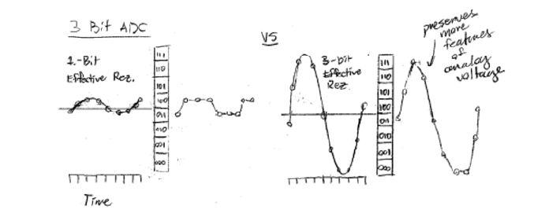
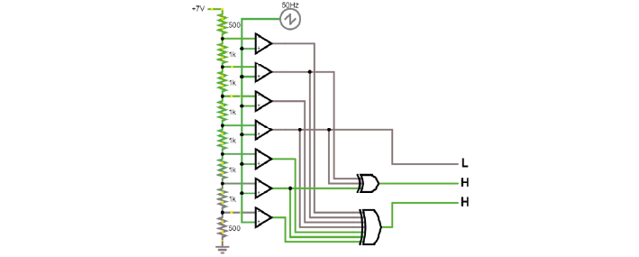
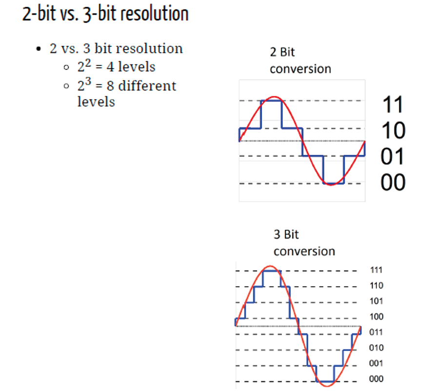

.. _refTDay4:

***********************************
Theory Day 4
***********************************

.. |Na+| replace:: Na\ :sup:`+`\
.. |Cl-| replace:: Cl\ :sup:`-`\
.. |Ca2+| replace:: Ca\ :sup:`2+`\
.. |K+| replace:: K\ :sup:`+`\
.. |Rs| replace:: R\ :sub:`s`\
.. |Rm| replace:: R\ :sub:`m`\
.. |Re| replace:: R\ :sub:`e`\
.. |Rsh| replace:: R\ :sub:`sh`\
.. |Ce| replace:: C\ :sub:`e`\
.. |Csh| replace:: C\ :sub:`sh`\
.. |Vin| replace:: V\ :sub:`in`\
.. |Vec| replace:: V\ :sub:`ec`\
.. |Vout| replace:: V\ :sub:`out`\
.. |Ve| replace:: V\ :sub:`e`\
.. |Za| replace:: Z\ :sub:`a`\
.. |Ze| replace:: Z\ :sub:`e`\

.. contents:: Table of Contents
  :depth: 2
  :local:

.. _refdigitization:

Digitization
###################################
The purpose of digitization is to convert amplified signals into digital values. Why do we digitize neural signals? To protect them from noise, and so that we can process and store them.
First, the output of the amplifier (Vout) should match the digitizer dynamic range. Your analog signal should ‘occupy’ as much as possible, i.e. all discrete values in the digitization range. In other words, digitization range should match maximum analog signal. If the dynamic range is too small the signal will saturate, and if it is too large it will decrease effective signal resolution.

If you have a voltage divider and an open-loop op-amp (comparator) you can already build a circuit that checks if your analog signal is above or below a certain value. Now instead of one voltage divider, you could have a whole ‘ladder’, creating intermediate values, and compare to these. This is an incredibly inefficient way to make an ADC.

Here’s what this may look like:

In practice, many ADCs still use the same basic idea of using op-amps as comparators, but instead of comparing millions of values to obtain a precise measurement, they generate a reference voltage from an internal DAC and adjust that until it matches the input voltage, or use some other clever tricks.

Typically AD converters have 12 to 16 bit resolution (4096 to 65536 discrete values) for neural signals, which is usually enough because of the size of the signals we want (spikes etc), and because the thermal noise floor of typical electrodes is similar to the achievable resolution anyway: better digitizers would just measure more of that noise. If you want to read more about that, have a look `here. <http://deuterontech.com/wp-content/uploads/2015/10/Deuteron_Noise_and_Interference.pdf>`_

Talk: Acquisition and Synchronization
########################################
One of the most common pitfalls in Neuroscience is correctly synchronizing multiple datastreams. How do you know whether your imaging and electrophysiology are aligned in time? How many different clocks do you have on your set up, and which of those can you trust?

.. raw:: html

   
  
<iframe width="560" height="340" src="https://www.youtube.com/embed/F0uwA3RUlB0" title="YouTube video player" frameborder="0" allow="accelerometer; autoplay; clipboard-write; encrypted-media; gyroscope; picture-in-picture" allowfullscreen></iframe>

   

The code for the exercises Filipe shows is available `on google drive <https://drive.google.com/drive/folders/1m_DTRXc1NcFni12a_9AtApX5nMIPPDdk?usp=sharing>`_ if you want to try it out yourself.
